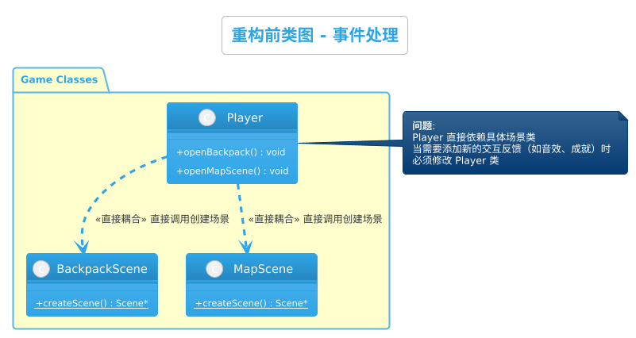
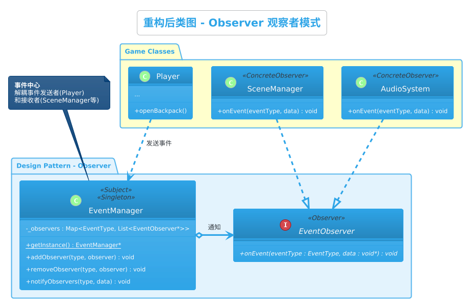
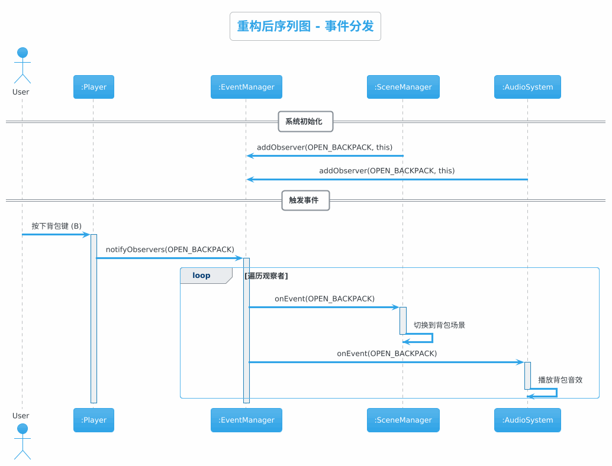
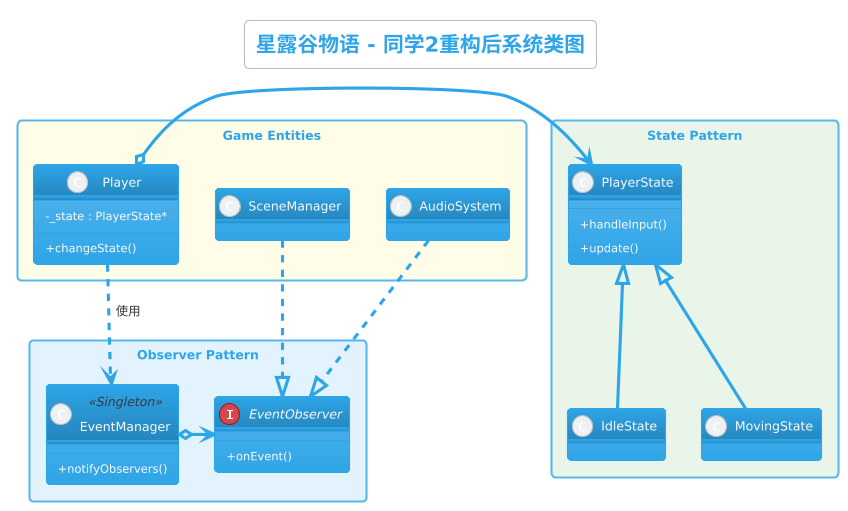

# 星露谷物语 - 设计模式重构报告

## 同学2：行为型设计模式重构

**作者**: 同学2  
**日期**: 2025年12月18日  
**负责模式**: State（状态模式）、Observer（观察者模式）

---

# 目录

1. [项目简介与重构动机](#一项目简介与重构动机)
2. [设计模式应用](#二设计模式应用)
   - 2.1 [State 状态模式](#21-state-状态模式)
   - 2.2 [Observer 观察者模式](#22-observer-观察者模式)
3. [完整系统设计](#三完整系统设计)
4. [其他重要问题与解决方案](#四其他重要问题与解决方案)
5. [文件变更清单](#五文件变更清单)
6. [总结](#六总结)

---

# 一、项目简介与重构动机

## 1.1 现有代码分析

在分析 `Player.cpp` 及相关代码后，发现以下行为逻辑方面的问题：

### 问题1：状态逻辑复杂且分散
```cpp
// Player.h 中的状态标志位
bool _isMoving;
bool _isMovingLeft;
bool _isMovingRight;
bool _isMovingUp;
bool _isMovingDown;

// Player.cpp 中的状态判断
if (!_isMovingLeft && !_isMovingRight && !_isMovingUp && !_isMovingDown) {
    _isMoving = false;
    stopWalkingAnimation();
}
```
- **影响**: 增加新的状态（如“攻击”、“交互”）需要添加新的布尔变量，并在所有相关逻辑中增加 `if-else` 判断。
- **违反原则**: 违反了**单一职责原则**（Player 类管理了过多的状态逻辑）和**开放封闭原则**（修改状态逻辑需要修改 Player 类）。

### 问题2：模块间耦合度高
```cpp
// Player.cpp 直接依赖具体场景类
#include "Scene/BackpackScene.h"
#include "Scene/MapScene.h"

void Player::openBackpack() {
    auto scene = BackpackScene::createScene(); // 硬编码
    Director::getInstance()->pushScene(...);
}
```
- **影响**: `Player` 类与具体的 `BackpackScene`、`MapScene` 紧密耦合。如果需要添加新的事件响应（例如打开背包时播放音效、更新UI任务状态），必须直接修改 `Player` 类。

## 1.2 重构目标

1.  **应用 State 模式**: 将玩家的状态逻辑（移动、待机、动作等）封装到独立的状态类中，消除复杂的 `if-else` 和标志位。
2.  **应用 Observer 模式**: 建立通用的事件系统，解耦事件发送者（如 Player）和接收者（如场景管理器、音频系统），增强系统的可扩展性。

---

# 二、设计模式应用

## 2.1 State 状态模式

### 2.1.1 模式概述

**状态模式（State Pattern）** 允许一个对象在其内部状态改变时改变它的行为。对象看起来似乎修改了它的类。

#### 模式结构

| 角色 | 职责 |
|-----|------|
| **Context** (Player) | 维护一个 ConcreteState 子类的实例，定义当前状态 |
| **State** (PlayerState) | 定义一个接口，封装与 Context 的一个特定状态相关的行为 |
| **ConcreteState** | 实现 State 接口，处理特定状态下的行为 |

### 2.1.2 代码对比

#### Player.h 状态定义

**重构前:**
```cpp
class Player : public cocos2d::Node {
private:
    bool _isMoving;
    bool _isMovingLeft;
    bool _isMovingRight;
    bool _isMovingUp;
    bool _isMovingDown;
    // ...
public:
    void onKeyPressed(EventKeyboard::KeyCode keyCode, Event* event);
    void update(float delta) override;
};
```

**重构后:**
```cpp
// 前向声明
class PlayerState;

class Player : public cocos2d::Node {
private:
    PlayerState* _state; // 当前状态引用
    friend class PlayerState; // 允许状态类访问 Player 私有成员

public:
    void changeState(PlayerState* newState);
    
    // 委托给状态处理
    void onKeyPressed(EventKeyboard::KeyCode keyCode, Event* event);
    void update(float delta) override;
};
```

#### PlayerState 接口与实现

**新增 `Classes/State/PlayerState.h`:**
```cpp
class PlayerState {
protected:
    Player* _player;
public:
    virtual ~PlayerState() {}
    virtual void enter() = 0;
    virtual void exit() = 0;
    virtual void handleInput(EventKeyboard::KeyCode keyCode) = 0;
    virtual void update(float delta) = 0;
};

class IdleState : public PlayerState {
public:
    void handleInput(EventKeyboard::KeyCode keyCode) override;
    // ...
};

class MovingState : public PlayerState {
    std::string _direction;
public:
    MovingState(std::string dir);
    void enter() override; // 播放移动动画
    void update(float delta) override; // 执行移动逻辑
    // ...
};
```

#### 逻辑实现对比

**重构前 (Player.cpp):**
```cpp
void Player::update(float delta) {
    Vec2 newLoc = loc;
    if (_isMovingLeft) newLoc.x -= speed * delta;
    if (_isMovingRight) newLoc.x += speed * delta;
    // ... 大量 if 判断
}
```

**重构后 (MovingState.cpp):**
```cpp
void MovingState::update(float delta) {
    // 状态类只关注移动逻辑
    Vec2 velocity = Vec2::ZERO;
    if (_direction == "Left") velocity.x = -speed;
    else if (_direction == "Right") velocity.x = speed;
    // ...
    _player->move(velocity * delta);
}
```

### 2.1.3 效益分析

1.  **消除条件分支**: 将巨大的 `switch` 和 `if` 逻辑分散到各个状态类中。
2.  **易于扩展**: 添加“跑步状态”或“攻击状态”只需新增一个类，无需修改 `Player` 现有代码。
3.  **状态隔离**: 每个状态独立管理自己的行为和数据（如 `MovingState` 管理方向），互不干扰。

---

## 2.2 Observer 观察者模式

### 2.2.1 模式概述

**观察者模式（Observer Pattern）** 定义对象间的一种一对多的依赖关系，当一个对象的状态发生改变时，所有依赖于它的对象都得到通知并被自动更新。

#### 模式结构

| 角色 | 职责 |
|-----|------|
| **Subject** (EventManager) | 保存观察者列表，提供注册/注销接口，发送通知 |
| **Observer** (EventObserver) | 定义更新接口 |
| **ConcreteObserver** | 实现更新接口，对事件做出响应 |

### 2.2.2 UML类图对比

#### 重构前类图



#### 重构后类图



#### 重构后序列图



### 2.2.3 代码设计

#### EventManager 事件中心

**新增 `Classes/Observer/EventManager.h`:**
```cpp
enum class EventType {
    PLAYER_MOVED,
    OPEN_BACKPACK,
    OPEN_MAP,
    ITEM_PICKED
};

class EventObserver {
public:
    virtual void onEvent(EventType type, void* data) = 0;
};

class EventManager {
private:
    static EventManager* _instance;
    std::map<EventType, std::vector<EventObserver*>> _observers;
    
public:
    static EventManager* getInstance();
    void addObserver(EventType type, EventObserver* observer);
    void removeObserver(EventType type, EventObserver* observer);
    void notifyObservers(EventType type, void* data = nullptr);
};
```

#### Player 事件发送

**重构前:**
```cpp
void Player::onKeyPressed(...) {
    case KEY_B:
        openBackpack(); // 直接调用内部方法，紧耦合
        break;
}
```

**重构后:**
```cpp
void Player::onKeyPressed(...) {
    case KEY_B:
        // 仅发送事件，不关心谁处理
        EventManager::getInstance()->notifyObservers(EventType::OPEN_BACKPACK);
        break;
}
```

#### 观察者响应

```cpp
// 场景管理器或其他系统
class GameSystem : public EventObserver {
    void onEvent(EventType type, void* data) override {
        if (type == EventType::OPEN_BACKPACK) {
            // 处理切换场景逻辑
            Director::getInstance()->pushScene(BackpackScene::createScene());
        }
    }
};
```

### 2.2.4 效益分析

1.  **解耦**: `Player` 不再需要引用 `BackpackScene` 或 `MapScene` 的头文件，也不需要知道场景切换的具体实现。
2.  **多重响应**: 一个事件（如“获得物品”）可以同时触发 UI 更新、成就系统检查、音效播放，而发送者无需修改代码。
3.  **动态绑定**: 可以在运行时动态添加或移除观察者。

---

# 三、完整系统设计

## 3.1 架构图



## 3.2 模式协同

- **State 模式** 负责处理 Player 内部的复杂逻辑状态流转。
- **Observer 模式** 负责将 Player 的关键行为（状态变化、交互）广播给外部系统。
- 两者结合使得 `Player` 类变得轻量化且高内聚，只关注自身的属性和当前状态委托，而将与外部的交互通过事件解耦。

---

# 四、其他重要问题与解决方案

## 4.1 状态切换的内存管理

### 问题
频繁创建和销毁 State 对象（如频繁按键移动）可能导致内存碎片或性能问题。

### 解决方案
- **单例状态**: 如果状态没有内部数据（如 `IdleState`），可以使用单例模式复用状态对象。
- **对象池**: 对于有内部数据（如方向）的 `MovingState`，可以使用对象池技术复用。

## 4.2 事件参数传递

### 问题
`void* data` 类型不安全，且需要手动转换。

### 解决方案
- 定义 `EventData` 基类和派生类（如 `MoveEventData`, `ItemEventData`）。
- 使用 `std::any` (C++17) 或自定义 Variant 类型（C++14下）来安全传递数据。

---

# 五、文件变更清单

## 5.1 新增文件

| 文件路径 | 描述 | 设计模式 | 预计代码行数 |
|---------|------|---------|-------------|
| `Classes/State/PlayerState.h` | 状态接口及具体状态类定义 | State | ~80行 |
| `Classes/State/PlayerState.cpp` | 状态行为实现 | State | ~150行 |
| `Classes/Observer/EventManager.h` | 事件管理器及观察者接口 | Observer | ~60行 |
| `Classes/Observer/EventManager.cpp` | 事件管理器实现 | Observer | ~50行 |

## 5.2 修改文件

| 文件路径 | 修改内容 | 设计模式 |
|---------|---------|---------|
| `Classes/Player/Player.h` | 移除布尔标志位，添加 State 成员，添加 Event 发送 | Both |
| `Classes/Player/Player.cpp` | 重构 input 和 update 逻辑，委托给 State 处理 | State |
| `CMakeLists.txt` | 添加新源文件到构建列表 | - |

---

# 六、总结

通过引入 **State 模式** 和 **Observer 模式**，我们成功解决了 `Player` 类日益膨胀和耦合过重的问题。

1.  **代码清晰度**: `Player::update` 从“大杂烩”变成了简洁的状态委托。
2.  **维护成本**: 修改移动逻辑只需关注 `MovingState`，修改背包逻辑只需关注相关观察者。
3.  **团队协作**: 不同的开发者可以分别负责不同的状态类或观察者实现，减少代码冲突。

本次重构为后续添加更多游戏特性（如战斗系统、复杂的NPC交互）奠定了坚实的架构基础。
