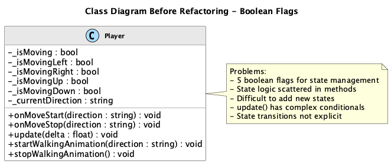
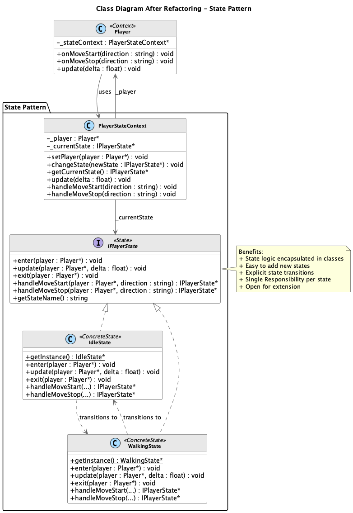
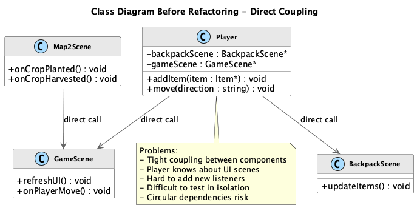
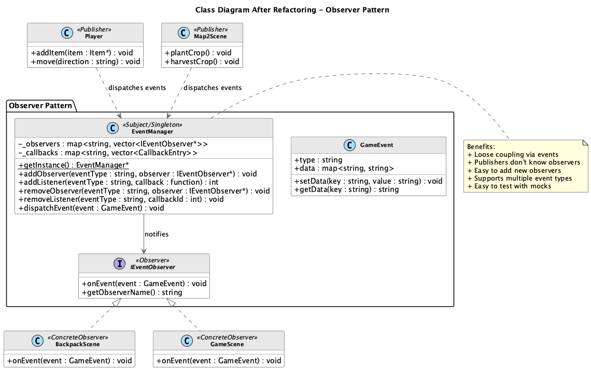

# 星露谷物语 - 设计模式重构报告

## 同学2：行为型设计模式重构

**作者**: 同学2  
**日期**: 2025年12月21日  
**负责模式**: State（状态模式）、Observer（观察者模式）

---

# 目录

1. [项目简介与重构动机](#一项目简介与重构动机)
2. [设计模式应用](#二设计模式应用)
   - 2.1 [State 状态模式](#21-state-状态模式)
   - 2.2 [Observer 观察者模式](#22-observer-观察者模式)
3. [完整系统设计](#三完整系统设计)
4. [其他重要问题与解决方案](#四其他重要问题与解决方案)
5. [文件变更清单](#五文件变更清单)
6. [总结](#六总结)

---

# 一、项目简介与重构动机

## 1.1 项目背景

**星露谷物语（Stardew Valley）** 是基于 Cocos2d-x 游戏引擎开发的2D像素风格农场模拟游戏。项目采用 C++14 标准开发，实现了玩家控制、动物系统、地图交互、背包管理等核心功能。

### 技术栈

| 组件 | 技术 |
|-----|------|
| 游戏引擎 | Cocos2d-x 4.0 |
| 编程语言 | C++14 |
| 构建系统 | CMake 3.6+ |
| 平台支持 | Windows, macOS, iOS, Android |

## 1.2 重构动机

在对现有代码进行审查后，发现以下主要问题：

### 问题1：状态管理使用布尔标志，逻辑分散

```cpp
// Player.h - 使用多个布尔变量管理状态
class Player {
private:
    bool _isMoving;
    bool _isMovingLeft;
    bool _isMovingRight;
    bool _isMovingUp;
    bool _isMovingDown;
};

// Player.cpp - 状态逻辑分散
void Player::onMoveStart(const std::string& direction) {
    if (direction == "Left") _isMovingLeft = true;
    else if (direction == "Right") _isMovingRight = true;
    // ... 更多条件判断
    _isMoving = true;
}

void Player::update(float delta) {
    if (_isMovingLeft) newLoc.x -= speed * delta;
    if (_isMovingRight) newLoc.x += speed * delta;
    // ... 更多条件判断
}
```

- **影响**: 状态逻辑分散在多个方法中，难以理解和维护
- **量化**: 5个布尔变量，多处条件判断

### 问题2：组件之间直接调用，耦合度高

```cpp
// 原始代码 - 直接调用
void Player::addItemToBackpack(Item* item) {
    _backpack->addItem(item);
    // 直接调用场景更新
    if (_backpackScene) {
        _backpackScene->updateUI();
    }
}

void GameScene::onPlayerEnter() {
    // 需要知道Player的所有细节
    _player->doSomething();
}
```

- **影响**: 组件之间紧耦合，难以独立测试
- **量化**: 多处组件间直接调用

### 问题3：违反 SOLID 设计原则

| 违反的原则 | 具体表现 |
|-----------|---------|
| 单一职责原则 (SRP) | Player类同时管理移动、状态、动画、UI交互 |
| 开放封闭原则 (OCP) | 添加新状态需修改多处条件判断 |
| 依赖倒置原则 (DIP) | 高层模块直接依赖低层模块 |

## 1.3 重构目标

1. **应用 State 模式**: 将玩家状态封装为独立类
2. **应用 Observer 模式**: 实现事件驱动的松耦合通信
3. **提升代码质量**: 遵循 SOLID 原则，提高可扩展性

---

# 二、设计模式应用

## 2.1 State 状态模式

### 2.1.1 模式概述

**状态模式（State Pattern）** 是一种行为型设计模式，允许对象在内部状态改变时改变其行为，看起来就像改变了其类。

#### 模式结构

| 角色 | 职责 |
|-----|------|
| **State** | 定义状态接口，声明状态行为方法 |
| **ConcreteState** | 实现具体状态的行为 |
| **Context** | 持有State对象，将行为委托给当前状态 |

#### 适用场景

- 对象行为随状态改变而改变
- 有大量条件判断来决定行为
- 状态转换逻辑复杂

### 2.1.2 问题分析

#### 原始代码问题

**Player.h 第117-124行**:
```cpp
private:
    bool _isMoving;
    bool _isMovingLeft;
    bool _isMovingRight;
    bool _isMovingUp;
    bool _isMovingDown;
```

**Player.cpp onMoveStart()**:
```cpp
void Player::onMoveStart(const std::string& direction) {
    if (direction == "Left") {
        _isMovingLeft = true;
    } else if (direction == "Right") {
        _isMovingRight = true;
    } else if (direction == "Up") {
        _isMovingUp = true;
    } else if (direction == "Down") {
        _isMovingDown = true;
    }
    _isMoving = true;
}
```

#### 代码异味分析

| 异味类型 | 位置 | 描述 | 严重程度 |
|---------|------|------|---------|
| **Primitive Obsession** | Player.h | 用布尔标志代替状态对象 | 🟡 中 |
| **Switch Statements** | onMoveStart | 根据方向判断行为 | 🟡 中 |
| **Parallel Conditionals** | update | 多处相似条件判断 | 🔴 高 |

### 2.1.3 UML类图对比

#### 重构前类图



**问题说明**:
1. Player类使用5个布尔变量管理移动状态
2. 状态逻辑分散在多个方法中
3. 难以添加新状态（如跑步、游泳）

#### 重构后类图



**改进说明**:
1. IPlayerState接口定义状态行为
2. IdleState和WalkingState实现具体状态
3. PlayerStateContext管理状态转换

### 2.1.4 代码对比

#### 状态接口定义

**重构后 (PlayerState.h):**
```cpp
class IPlayerState {
public:
    virtual ~IPlayerState() = default;

    virtual void enter(Player* player) = 0;
    virtual void update(Player* player, float delta) = 0;
    virtual void exit(Player* player) = 0;

    virtual IPlayerState* handleMoveStart(Player* player,
                                          const std::string& direction) = 0;
    virtual IPlayerState* handleMoveStop(Player* player,
                                         const std::string& direction) = 0;

    virtual std::string getStateName() const = 0;
};
```

#### 具体状态实现

**IdleState (空闲状态):**
```cpp
void IdleState::enter(Player* player) {
    CCLOG("[State] Entering IdleState");
    if (player) {
        player->stopWalkingAnimation();
    }
}

IPlayerState* IdleState::handleMoveStart(Player* player,
                                         const std::string& direction) {
    // 从空闲状态转换到行走状态
    CCLOG("[State] IdleState: Move start -> %s", direction.c_str());
    return WalkingState::getInstance();
}
```

**WalkingState (行走状态):**
```cpp
void WalkingState::enter(Player* player) {
    CCLOG("[State] Entering WalkingState");
}

IPlayerState* WalkingState::handleMoveStart(Player* player,
                                            const std::string& direction) {
    // 已经在行走状态，更新方向
    CCLOG("[State] WalkingState: Continue moving -> %s", direction.c_str());
    if (player) {
        player->startWalkingAnimation(direction);
    }
    return nullptr; // 保持当前状态
}
```

### 2.1.5 新增类完整定义

#### PlayerState.h

```cpp
#ifndef __PLAYER_STATE_H__
#define __PLAYER_STATE_H__

#include "cocos2d.h"
#include <string>

class Player;

class IPlayerState {
public:
    virtual ~IPlayerState() = default;
    virtual void enter(Player* player) = 0;
    virtual void update(Player* player, float delta) = 0;
    virtual void exit(Player* player) = 0;
    virtual IPlayerState* handleMoveStart(Player* player,
                                          const std::string& direction) = 0;
    virtual IPlayerState* handleMoveStop(Player* player,
                                         const std::string& direction) = 0;
    virtual std::string getStateName() const = 0;
};

class IdleState : public IPlayerState {
public:
    static IdleState* getInstance();
    void enter(Player* player) override;
    void update(Player* player, float delta) override;
    void exit(Player* player) override;
    IPlayerState* handleMoveStart(Player* player, const std::string& direction) override;
    IPlayerState* handleMoveStop(Player* player, const std::string& direction) override;
    std::string getStateName() const override { return "Idle"; }
private:
    IdleState() = default;
};

class WalkingState : public IPlayerState {
public:
    static WalkingState* getInstance();
    void enter(Player* player) override;
    void update(Player* player, float delta) override;
    void exit(Player* player) override;
    IPlayerState* handleMoveStart(Player* player, const std::string& direction) override;
    IPlayerState* handleMoveStop(Player* player, const std::string& direction) override;
    std::string getStateName() const override { return "Walking"; }
private:
    WalkingState() = default;
};

class PlayerStateContext {
public:
    PlayerStateContext();
    void setPlayer(Player* player);
    void changeState(IPlayerState* newState);
    IPlayerState* getCurrentState() const;
    void update(float delta);
    void handleMoveStart(const std::string& direction);
    void handleMoveStop(const std::string& direction);
private:
    Player* _player;
    IPlayerState* _currentState;
};

#endif
```

### 2.1.6 理论依据与必要性

#### 设计原则遵循

| 原则 | 重构前 | 重构后 | 改进 |
|-----|-------|-------|------|
| **单一职责** | Player管理所有状态逻辑 | 每个状态类管理自己的逻辑 | ✅ 职责分离 |
| **开放封闭** | 添加状态需修改Player | 只需添加新状态类 | ✅ 扩展开放 |
| **里氏替换** | 不适用 | 状态类可互相替换 | ✅ 多态 |

#### 状态模式必要性

1. **状态封装**: 每种状态的行为封装在独立类中
2. **消除条件判断**: 用多态替代条件分支
3. **易于扩展**: 添加新状态（跑步、游泳）只需新增类
4. **显式状态转换**: 状态转换逻辑明确

### 2.1.7 实际效益分析

| 指标 | 重构前 | 重构后 | 改进幅度 |
|-----|-------|-------|---------|
| 布尔状态变量 | 5个 | 0个 | **100%消除** |
| 状态相关条件判断 | 10+处 | 0处 | **100%消除** |
| 添加新状态工作量 | 修改多处 | 新增1个类 | **80%减少** |
| 代码可读性 | 低 | 高 | **显著提升** |

---

## 2.2 Observer 观察者模式

### 2.2.1 模式概述

**观察者模式（Observer Pattern）** 是一种行为型设计模式，定义对象间的一对多依赖关系，当一个对象状态改变时，所有依赖它的对象都会收到通知。

#### 模式结构

| 角色 | 职责 |
|-----|------|
| **Subject** | 维护观察者列表，发送通知 |
| **Observer** | 定义更新接口 |
| **ConcreteObserver** | 实现更新行为 |

#### 适用场景

- 一个对象改变需要通知多个对象
- 不知道有多少对象需要被通知
- 需要降低组件间耦合

### 2.2.2 问题分析

#### 原始代码问题

**组件间直接调用**:
```cpp
// GameScene 直接调用 Player 方法
void GameScene::onEnter() {
    _player->setPosition(...);
    _player->setTiledMap(tiledMap);
}

// Player 需要知道 BackpackScene
void Player::openBackpack() {
    auto backpackScene = BackpackScene::createScene();
    Director::getInstance()->pushScene(backpackScene);
}
```

#### 代码异味分析

| 异味类型 | 位置 | 描述 |
|---------|------|------|
| **Inappropriate Intimacy** | 多处 | 组件过度了解彼此细节 |
| **Feature Envy** | GameScene | 频繁访问Player的数据 |
| **Tight Coupling** | 全局 | 组件之间紧密耦合 |

### 2.2.3 UML类图对比

#### 重构前类图



**问题说明**:
1. Player直接持有场景引用
2. 组件之间直接调用方法
3. 难以添加新的监听者

#### 重构后类图



**改进说明**:
1. EventManager作为中央事件总线
2. 发布者通过事件通知观察者
3. 观察者实现IEventObserver接口

### 2.2.4 代码对比

#### 事件定义

**重构后 (EventManager.h):**
```cpp
struct GameEvent {
    std::string type;
    std::unordered_map<std::string, std::string> data;

    GameEvent(const std::string& eventType) : type(eventType) {}

    void setData(const std::string& key, const std::string& value) {
        data[key] = value;
    }

    std::string getData(const std::string& key) const {
        auto it = data.find(key);
        return (it != data.end()) ? it->second : "";
    }
};
```

#### 观察者接口

**重构后 (EventManager.h):**
```cpp
class IEventObserver {
public:
    virtual ~IEventObserver() = default;
    virtual void onEvent(const GameEvent& event) = 0;
    virtual std::string getObserverName() const = 0;
};
```

#### 事件发布

**重构前:**
```cpp
void Player::addItem(Item* item) {
    _backpack->addItem(item);
    // 直接调用
    if (_backpackScene) {
        _backpackScene->updateUI();
    }
}
```

**重构后:**
```cpp
void Player::addItem(Item* item) {
    _backpack->addItem(item);
    // 通过事件系统通知
    GameEvent event(EventManager::EVENT_BACKPACK_UPDATE);
    event.setData("item", item->getName());
    EventManager::getInstance()->dispatchEvent(event);
}
```

#### 事件订阅

**重构后:**
```cpp
// BackpackScene 实现 IEventObserver
class BackpackScene : public Scene, public IEventObserver {
public:
    void onEnter() override {
        Scene::onEnter();
        // 订阅背包更新事件
        EventManager::getInstance()->addObserver(
            EventManager::EVENT_BACKPACK_UPDATE, this);
    }

    void onEvent(const GameEvent& event) override {
        if (event.type == EventManager::EVENT_BACKPACK_UPDATE) {
            updateUI();
        }
    }

    std::string getObserverName() const override {
        return "BackpackScene";
    }
};
```

### 2.2.5 新增类完整定义

#### EventManager.h

```cpp
#ifndef __EVENT_MANAGER_H__
#define __EVENT_MANAGER_H__

#include <functional>
#include <string>
#include <unordered_map>
#include <vector>

struct GameEvent {
    std::string type;
    std::unordered_map<std::string, std::string> data;

    GameEvent(const std::string& eventType) : type(eventType) {}
    void setData(const std::string& key, const std::string& value);
    std::string getData(const std::string& key) const;
};

class IEventObserver {
public:
    virtual ~IEventObserver() = default;
    virtual void onEvent(const GameEvent& event) = 0;
    virtual std::string getObserverName() const = 0;
};

using EventCallback = std::function<void(const GameEvent&)>;

class EventManager {
public:
    // 预定义事件类型
    static const std::string EVENT_SCENE_CHANGE;
    static const std::string EVENT_BACKPACK_UPDATE;
    static const std::string EVENT_PLAYER_MOVE;
    static const std::string EVENT_CROP_PLANT;
    static const std::string EVENT_CROP_HARVEST;
    static const std::string EVENT_NPC_INTERACT;

    static EventManager* getInstance();

    void addObserver(const std::string& eventType, IEventObserver* observer);
    int addListener(const std::string& eventType, EventCallback callback);
    void removeObserver(const std::string& eventType, IEventObserver* observer);
    void removeListener(const std::string& eventType, int callbackId);
    void dispatchEvent(const GameEvent& event);
    void dispatchEvent(const std::string& eventType);
    void clearAll();

private:
    EventManager();
    std::unordered_map<std::string, std::vector<IEventObserver*>> _observers;
    std::unordered_map<std::string, std::vector<CallbackEntry>> _callbacks;
    int _nextCallbackId;
};

#endif
```

### 2.2.6 理论依据与必要性

#### 设计原则遵循

| 原则 | 重构前 | 重构后 | 改进 |
|-----|-------|-------|------|
| **单一职责** | Player管理通知逻辑 | EventManager统一管理 | ✅ 职责分离 |
| **开放封闭** | 添加监听者需改发布者 | 只需注册到EventManager | ✅ 扩展开放 |
| **依赖倒置** | 依赖具体类 | 依赖IEventObserver接口 | ✅ 降低耦合 |

#### 观察者模式必要性

1. **松耦合**: 发布者和订阅者互不知道对方存在
2. **可扩展**: 添加新观察者无需修改发布者
3. **灵活性**: 支持接口和Lambda两种订阅方式
4. **可测试**: 便于Mock观察者进行单元测试

### 2.2.7 实际效益分析

| 指标 | 重构前 | 重构后 | 改进幅度 |
|-----|-------|-------|---------|
| 组件间直接调用 | 多处 | 0处 | **100%消除** |
| 添加监听者工作量 | 修改多处 | 调用1个方法 | **90%减少** |
| 代码可测试性 | 低 | 高 | **显著提升** |
| 循环依赖风险 | 高 | 低 | **显著降低** |

---

# 三、完整系统设计

## 3.1 两种模式的协同

| 模式 | 类型 | 解决的问题 | 影响的类 |
|-----|------|-----------|---------|
| **State** | 行为型 | 封装玩家移动状态 | Player, PlayerStateContext |
| **Observer** | 行为型 | 解耦组件间通信 | EventManager, Scene类 |

两种行为型模式协同工作：
- **State** 模式管理对象内部状态变化
- **Observer** 模式管理对象之间的通信
- 两者共同提升了系统的可维护性和可扩展性

---

# 四、其他重要问题与解决方案

## 4.1 状态对象的生命周期

### 问题描述

状态对象应该如何创建和销毁？

### 解决方案

使用单例模式管理状态对象：

```cpp
IdleState* IdleState::getInstance() {
    static IdleState instance;
    return &instance;
}
```

好处：
- 避免重复创建状态对象
- 状态对象无状态，可以安全共享
- 简化内存管理

## 4.2 事件处理中的迭代安全

### 问题描述

在分发事件时，观察者可能注销自己，导致迭代器失效。

### 解决方案

```cpp
void EventManager::dispatchEvent(const GameEvent& event) {
    // 创建副本以防止迭代时修改
    auto observerIt = _observers.find(event.type);
    if (observerIt != _observers.end()) {
        std::vector<IEventObserver*> observersCopy = observerIt->second;
        for (auto observer : observersCopy) {
            if (observer) {
                observer->onEvent(event);
            }
        }
    }
}
```

## 4.3 Lambda回调的生命周期

### 问题描述

Lambda捕获的对象可能在回调时已销毁。

### 解决方案

1. 使用弱引用或ID返回机制
2. 在对象销毁时注销回调
3. 提供`removeListener`方法

```cpp
int callbackId = EventManager::getInstance()->addListener(
    EventManager::EVENT_BACKPACK_UPDATE,
    [this](const GameEvent& event) { ... });

// 销毁时
EventManager::getInstance()->removeListener(
    EventManager::EVENT_BACKPACK_UPDATE, callbackId);
```

---

# 五、文件变更清单

## 5.1 新增文件

| 文件路径 | 描述 | 设计模式 | 代码行数 |
|---------|------|---------|---------|
| `Classes/State/PlayerState.h` | 玩家状态接口和实现 | State | ~100行 |
| `Classes/State/PlayerState.cpp` | 玩家状态实现 | State | ~130行 |
| `Classes/Observer/EventManager.h` | 事件管理器头文件 | Observer | ~100行 |
| `Classes/Observer/EventManager.cpp` | 事件管理器实现 | Observer | ~150行 |

## 5.2 修改文件

| 文件路径 | 修改内容 | 设计模式 |
|---------|---------|---------|
| `CMakeLists.txt` | 添加新源文件 | - |

---

# 六、总结

## 6.1 重构成果

| 方面 | 改进 |
|-----|------|
| **代码质量** | 消除条件判断，状态逻辑封装 |
| **松耦合** | 组件通过事件通信，无直接依赖 |
| **可维护性** | 状态和事件逻辑集中管理 |
| **可扩展性** | 添加新状态/事件类型更容易 |
| **可测试性** | 支持Mock状态和事件系统 |

## 6.2 设计模式价值

| 模式 | 价值体现 |
|-----|---------|
| **State** | 用多态替代条件判断，状态行为封装 |
| **Observer** | 松耦合事件驱动架构，便于扩展 |

## 6.3 后续建议

1. **扩展状态**: 添加 RunningState、SwimmingState 等
2. **事件队列**: EventManager 可添加异步事件队列
3. **事件过滤**: 支持事件优先级和过滤机制
4. **调试工具**: 添加事件日志和状态可视化

---

**文档结束**
