# 星露谷项目文档

## 一、项目概述

### 1.1 项目背景

随着模拟经营类游戏的兴起，如《星露谷物语》《牧场物语》等，这类游戏凭借其轻松自由的玩法和丰富的系统内容，吸引了大量玩家。模拟经营类游戏的核心玩法是通过农场管理、资源收集和角色成长，不断发展个人农场并体验完整的乡村生活。这类游戏不仅强调长期规划和经营策略，还为玩家提供了高度自由和沉浸式的游戏体验。

基于这一背景，本项目旨在开发一款类似《星露谷物语》的农场模拟经营类游戏。项目在原有版本中实现了基础的农场经营玩法，包括作物种植与收获、动物养殖、资源采集以及角色能力成长等功能。同时，游戏还引入了社区交互与任务系统，玩家可以与镇上居民建立关系，完成委托任务，并参与多种社区活动，丰富整体游戏内容和玩法层次。

此外，项目还支持地图探索与冒险玩法，玩家可以前往森林、山脉和洞穴等区域进行探索，采集矿物和稀有资源。通过对农场经营、社区互动与探索系统的综合设计，玩家可以在一个充满生活气息的乡村世界中，体验经营农场、成长角色以及自由探索的乐趣。

### 1.2 项目简介

本项目是一款基于 Cocos2d-x 3.17.2 引擎开发的农场模拟经营类游戏，灵感来源于《星露谷物语》《牧场物语》等经典模拟经营游戏。游戏以农场生活为核心，玩家通过耕种作物、养殖动物、采集资源以及参与社区活动，不断发展自己的农场并提升角色能力，与游戏中的居民和环境进行互动。游戏不仅还原了经典农场模拟类游戏的核心玩法，还融合了探索与成长元素，为玩家提供轻松且富有沉浸感的游戏体验。

游戏的主要特色包括：

- 多样化的农场经营系统：支持多种作物的种植与收获，以及牛、羊、猪等动物的养殖，玩家可以通过合理规划农场布局和经营策略，逐步提升农场规模与收益。
- 社区交互与任务系统：玩家可以与镇上的居民建立关系，接受并完成各类委托任务，参与社区活动，增强游戏世界的互动性和生活气息。
- 探索与资源采集玩法：游戏提供多个可探索区域，包括森林、山脉和洞穴，玩家可以在探索过程中采集矿物和稀有资源，丰富游戏内容与玩法层次。
- 角色成长与装备系统：游戏包含角色技能成长机制，随着游戏进程的推进，玩家可以提升角色属性，并在背包界面中为角色更换装备，增强整体能力。
- 界面与操作体验设计：游戏设计了清晰直观的操作方式和功能界面，结合基础音效表现，提升整体游戏的沉浸感和可玩性。

本项目的目标是为玩家提供一个兼具经营乐趣与探索体验的农场模拟游戏，通过丰富的系统设计和多样化的玩法内容，构建一个充满生活气息与自由度的虚拟乡村世界，使玩家在游戏过程中获得持续的成就感和体验乐趣。

#### 游戏截图展示

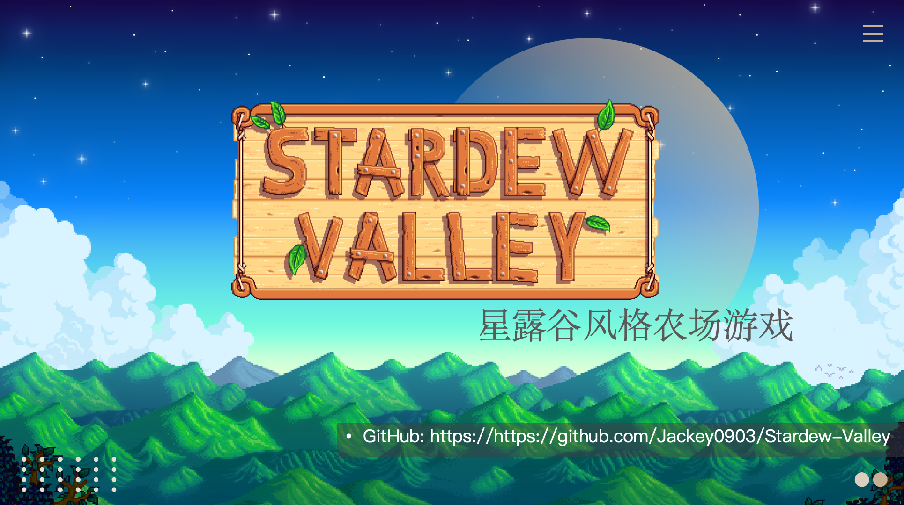

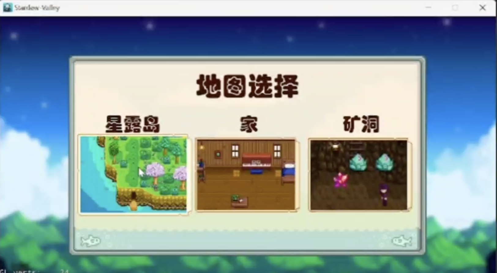

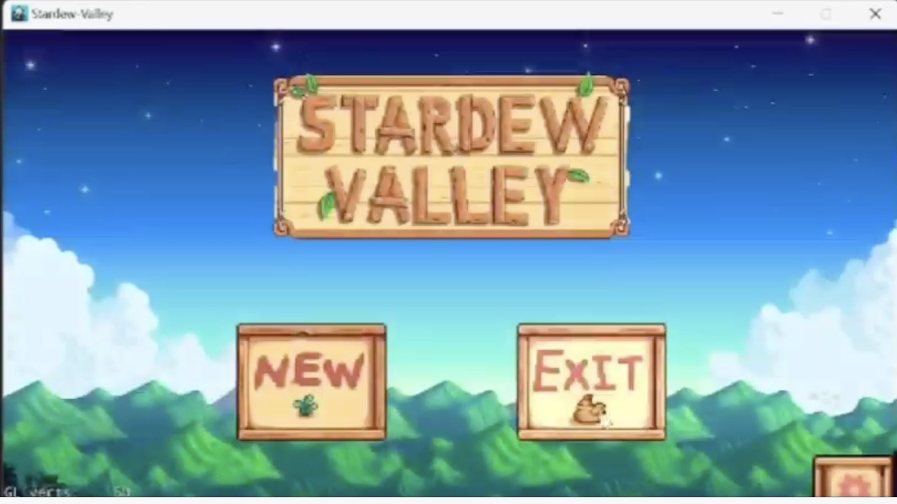

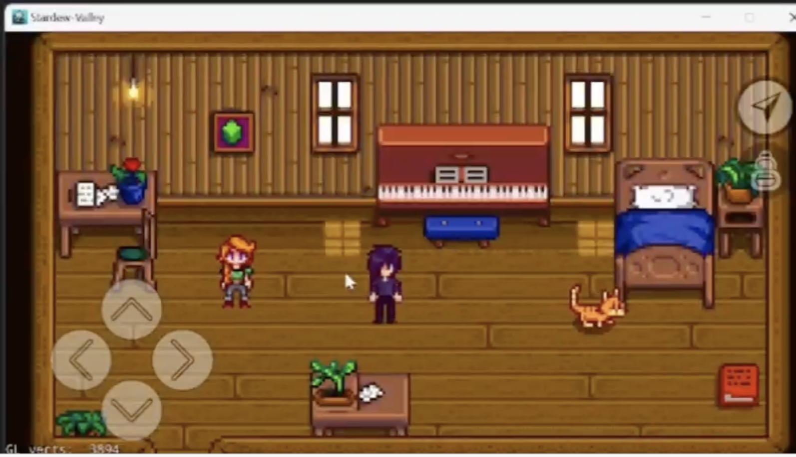

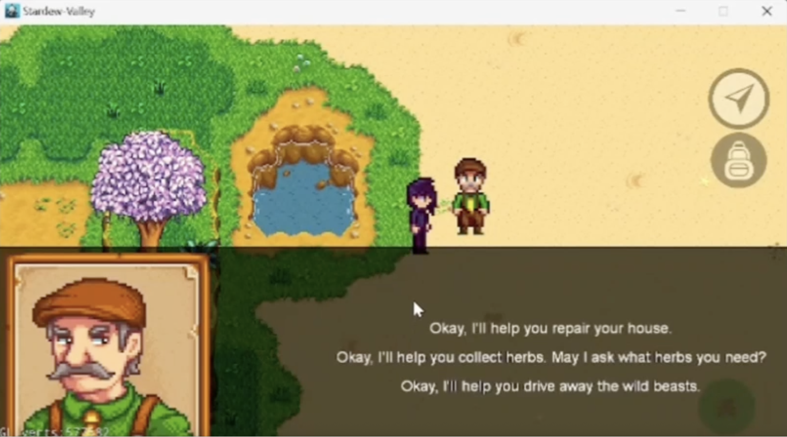

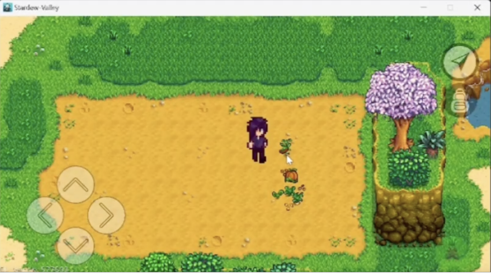

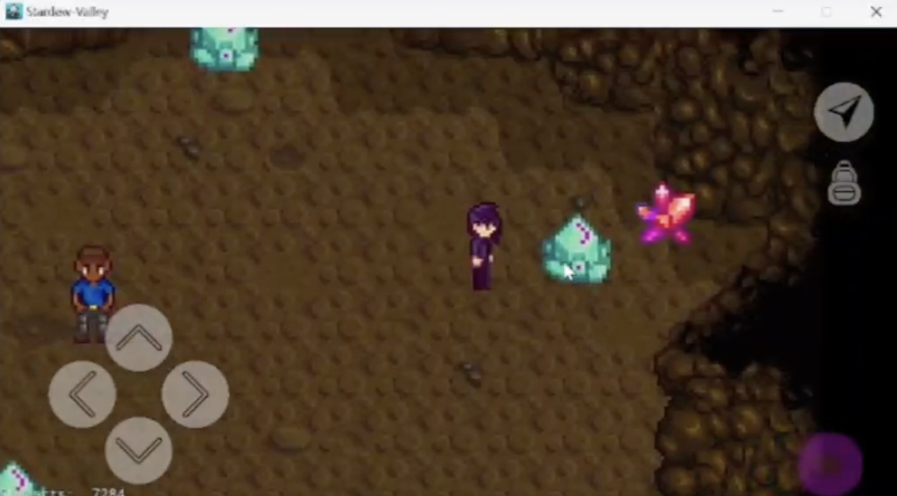

### 1.3 项目主要功能

- **农场管理**

  - 玩家可以在农场中进行耕种、种植与收获操作，支持多种作物类型，如胡萝卜、南瓜等。

  - 农场系统支持浇水、施肥、收获等基础经营操作，构成游戏的核心玩法之一。

  - 支持树木的种植与砍伐，用于获取农场经营所需的基础资源。

- **社区交互**

  - 玩家可以与镇上的居民建立关系，包括友谊关系和浪漫关系，并可在家中与伴侣进行对话互动。

  - 游戏支持接受并完成居民发布的委托任务，例如收集特定物品、协助修复建筑等，用于推动游戏进程和内容解锁。

- **探索和冒险**

  - 玩家可以探索农场周边区域，包括森林、山脉以及神秘洞穴等多种场景。

  - 在探索过程中，玩家可以在洞穴中挖掘矿物并收集稀有宝石，获取重要资源。

- **角色成长和技能**

  - 游戏提供角色技能树系统，包含人物移动速度、人物力量等多种成长方向，随着技能提升，角色能力逐步增强。

  - 支持背包界面中的物品管理与装备更换，用于提升角色整体能力和游戏体验。

## 二、 使用结构型模式重构

### 2.1 使用享元模式（Flyweight Pattern）重构

#### 2.1.1 模式概述

**享元模式**（Flyweight Pattern） 是一种结构型设计模式，通过共享技术有效支持大量细粒度对象的复用，以减少内存占用和提高性能。

**模式结构**

| 角色                  | 职责               |
| --------------------- | ------------------ |
| **Flyweight**         | 定义共享对象的接口 |
| **ConcreteFlyweight** | 实现共享的具体对象 |
| **FlyweightFactory**  | 创建和管理享元对象 |
| **Client**            | 使用享元对象       |

**适用场景**

- 系统中存在大量相似对象
- 对象的大部分状态可以外部化
- 需要缓冲池来复用对象

#### 2.1.2 问题分析

在重构前的代码中，角色动画资源的管理方式存在以下问题：

**问题1：资源加载分散，重复创建对象**

- Player 类和 Animal 类中分别加载相同的动画资源，例如行走动画所使用的 plist 文件。
- 每个实例在初始化时都会调用 `SpriteFrameCache::addSpriteFramesWithFile`，缺乏统一的资源管理机制，造成资源重复加载和内存浪费。

```cpp
// Player.cpp / Animal.cpp 中均存在类似代码
SpriteFrameCache::getInstance()->addSpriteFramesWithFile("Action/Walk_Left.plist");
SpriteFrameCache::getInstance()->addSpriteFramesWithFile("Action/Walk_Right.plist");
SpriteFrameCache::getInstance()->addSpriteFramesWithFile("Action/Walk_Up.plist");
SpriteFrameCache::getInstance()->addSpriteFramesWithFile("Action/Walk_Down.plist");
```

**问题2：动画对象频繁创建，性能开销较大**

- 在角色移动过程中，每次触发动画都会重新创建 `Animation` 和 `Animate` 对象。
- 动画帧数据在逻辑上是相同的，但未进行缓存和复用，增加了不必要的对象创建和销毁开销。

```cpp
void Player::startWalkingAnimation(const std::string &direction) {
    ...
    // 问题：每次调用都创建新的Animation对象
    auto walkAnimation = Animation::createWithSpriteFrames(frames, 0.1f);
    auto animate = Animate::create(walkAnimation);
    _playerSprite->runAction(RepeatForever::create(animate));
}
```

**问题3：类职责不清，耦合度较高**

- Player 和 Animal 类直接依赖 `SpriteFrameCache`，同时负责动画资源加载和动画播放逻辑。
- 动画管理逻辑分散在多个类中，违背了单一职责原则，后续维护和扩展难度较大。

##### 重构必要性

综上所述，原有动画系统在资源管理和对象创建方面存在明显问题：动画资源加载分散，缺乏统一管理；动画对象频繁创建，造成内存浪费和性能损耗；同时角色类承担了过多与动画管理相关的职责，代码耦合度较高。

为了解决上述问题，有必要对动画系统进行结构性重构。享元模式通过**共享可复用对象、集中管理相同状态的数据**，能够有效减少重复对象的创建，降低内存占用，并提升系统整体性能，因此非常适合用于本项目中的动画资源管理场景。

------

#### 2.1.3 UML类图对比

##### 重构前类图


##### 重构后类图


------

#### 2.1.4 重构步骤

为了解决上述问题，本项目使用享元模式对动画系统进行重构，具体步骤如下：

1. **引入享元工厂类 `AnimationFlyweight`**

定义 `AnimationFlyweight` 类作为享元工厂，负责统一管理和缓存动画对象。该类内部维护一个动画池，用于存储已创建的 Animation 对象。

```cpp
class AnimationFlyweight {
public:
  // 获取单例实例
  static AnimationFlyweight *getInstance();
  // 获取共享动画对象（享元）
  cocos2d::Animation *getAnimation(const std::string &key);
  // 检查动画是否已加载
  bool hasAnimation(const std::string &key) const;
  // 预加载玩家动画资源
  void preloadPlayerAnimations();
  // 预加载动物动画资源
  void preloadAnimalAnimations(const std::string &animalName);
  // 清理所有缓存的动画资源
  void clearAllAnimations();
  // 获取当前缓存的动画数量
  size_t getCachedAnimationCount() const { return _animationPool.size(); }

private:
  AnimationFlyweight() = default;
  ~AnimationFlyweight();
  // 禁用拷贝
  AnimationFlyweight(const AnimationFlyweight &) = delete;
  AnimationFlyweight &operator=(const AnimationFlyweight &) = delete;
  static AnimationFlyweight *_instance;
  // 享元池：存储共享的动画对象
  std::unordered_map<std::string, cocos2d::Animation *> _animationPool;
  // 创建行走动画
  cocos2d::Animation *createWalkAnimation(const std::string &prefix,int frameCount,float interval = 0.1f);
};
```

2. **集中动画资源的预加载与管理**

将原本分散在 Player 和 Animal 中的动画加载逻辑，统一移动到 `AnimationFlyweight` 中进行管理，在游戏启动或首次使用时完成动画资源的预加载。

```cpp
// Player.cpp (仅首次加载)
#include "Animation/AnimationFlyweight.h"
...
AnimationFlyweight::getInstance()->preloadPlayerAnimations();
```

3. **通过享元工厂获取共享动画对象**

在角色播放动画时，不再直接创建 Animation 对象，而是通过动画标识从 `AnimationFlyweight` 中获取已缓存的动画实例。

```cpp
void Player::startWalkingAnimation(const std::string &direction) {
    ...
    // 从享元池获取共享Animation
    std::string animKey = "Player_Walk_" + direction;
    auto animation = AnimationFlyweight::getInstance()->getAnimation(animKey);
    
    if (animation) {
        _playerSprite->runAction(RepeatForever::create(Animate::create(animation)));
    }
}
```

4. **修改角色类以使用享元对象**

Player 和 Animal 类仅负责调用享元工厂获取动画并执行播放逻辑，不再关心动画资源的具体创建过程，从而降低类之间的耦合。

------

#### 2.1.5 实现的改进

通过引入享元模式，动画系统在多个方面得到了显著改进：

- **减少内存占用**：动画对象被缓存并复用，避免了重复创建相同的 Animation 实例，显著降低了内存消耗。
- **提升运行性能**：减少了动画对象的频繁创建和销毁，降低了运行时的性能开销。
- **职责更加清晰**：动画资源管理职责集中在 `AnimationFlyweight` 中，角色类只负责业务逻辑，代码结构更加清晰。
- **提高可维护性与可扩展性**：新增或修改动画资源只需调整享元工厂类，不需要修改多个角色类，降低了维护成本。
- **便于统一管理与调试**：动画资源集中管理，方便进行预加载、释放和问题排查。

------

### 2.2 使用适配器模式（Adapter Pattern）重构

#### 2.2.1 模式概述

**适配器模式（Adapter Pattern）** 是一种结构型设计模式，将一个类的接口转换成客户希望的另一个接口，使原本由于接口不兼容而不能一起工作的类可以协同工作。

**模式结构**

| 角色        | 职责                          |
| ----------- | ----------------------------- |
| **Target**  | 定义客户期望的接口            |
| **Adapter** | 将Adaptee接口转换为Target接口 |
| **Adaptee** | 被适配的现有接口              |
| **Client**  | 使用Target接口的类            |

**适用场景**

- 需要使用现有类，但其接口不符合需求
- 需要创建可复用的类，与不相关的类协同工作
- 需要统一多个类的接口

#### 2.2.2 问题分析

在重构前的代码中，玩家输入处理模块的设计存在以下问题：

**问题1：输入处理逻辑重复，代码冗余严重**

- 玩家移动与交互逻辑分别在**键盘输入处理函数**和**触摸输入处理函数**中实现。
- 两种输入方式中包含大量相同的移动判断和状态更新代码，整体重复代码量约为数百行。

```cpp
// 键盘输入处理
void Player::onKeyPressed(EventKeyboard::KeyCode keyCode, Event *event) {
    _isMoving = true;
    // 移动逻辑
    switch (keyCode) {
    case EventKeyboard::KeyCode::KEY_A:
        if (!_isMovingLeft) {
            _isMovingLeft = true;
            _currentTexture = "Action/Stand_Left.png";
            _playerSprite->setTexture(_currentTexture);
            _currentDirection = "Left";
            startWalkingAnimation(_currentDirection);
        }
        break;
    // ... 其他方向类似 ...
    case EventKeyboard::KeyCode::KEY_B:
        openBackpack();
        break;
    case EventKeyboard::KeyCode::KEY_M:
        openMapScene();
        break;
    }
}
```

```cpp
// 触摸输入处理
void Player::initTouchControls() {
    _btnUp = ui::Button::create("../Resources/KEYS/U.png");
    _btnUp->setPosition(Vec2(KEYS_CENTER_X, KEYS_CENTER_Y + KEYS_RADIUS));
    _btnUp->addTouchEventListener([this](Ref* sender, ui::Widget::TouchEventType type) {
        if (type == ui::Widget::TouchEventType::BEGAN) {
            // 与键盘处理完全相同的逻辑！
            if (!_isMovingUp) {
                _isMovingUp = true;
                _isMoving = true;
                _currentTexture = "Action/Stand_Up.png";
                _playerSprite->setTexture(_currentTexture);
                _currentDirection = "Up";
                startWalkingAnimation(_currentDirection);
            }
        }
    });
    this->addChild(_btnUp);
    // ... 还有5个按钮，每个都有类似的代码 ...
}
```

**问题2：Player 类职责过多，结构臃肿**

- Player 类同时负责角色状态管理、动画控制以及键盘和触摸输入的具体处理。
- 类中包含多个按钮对象、监听器以及大量输入相关代码，违反单一职责原则。

**问题3：扩展性不足**

- 当前输入逻辑与具体输入方式（键盘、触摸）强耦合。
- 若需要新增输入方式（如手柄输入），必须直接修改 Player 类，增加维护成本和出错风险。

##### 重构必要性

综合来看，原有输入系统存在代码重复严重、类职责不清以及扩展性不足等问题。输入逻辑分散在多个函数中，不仅增加了维护难度，也不利于后续功能扩展。

为了解决输入接口不统一和代码冗余的问题，有必要对输入系统进行结构性重构。适配器模式能够将不同输入方式的接口进行统一封装，使客户端只依赖统一接口，从而消除重复代码、降低耦合度，并提升系统的可扩展性，因此非常适合用于本项目的输入处理模块。

------

#### 2.2.3 UML类图对比

##### 重构前类图


##### 重构后类图


------

#### 2.2.4 重构步骤

针对上述问题，本项目使用适配器模式对输入系统进行重构，具体步骤如下：

1. **定义统一的输入接口**

定义输入处理接口 `IInputHandler`，用于描述玩家期望的输入行为，包括移动开始、移动结束以及功能性操作等。

```cpp
class IInputHandler {
public:
  virtual ~IInputHandler() = default;
  // 移动开始事件
  virtual void onMoveStart(const std::string &direction) = 0;
  // 移动停止事件
  virtual void onMoveStop(const std::string &direction) = 0;
  // 动作事件（打开背包、地图等）
  virtual void onAction(const std::string &action) = 0;
};

/**
 * KeyboardInputAdapter - 键盘输入适配器
 * 将Cocos2d的键盘事件适配到IInputHandler接口
 */
class KeyboardInputAdapter {
public:
  explicit KeyboardInputAdapter(IInputHandler *handler);

  void setupListener(cocos2d::Node *node);
  void removeListener();

private:
  IInputHandler *_handler;
  cocos2d::EventListenerKeyboard *_listener;

  void onKeyPressed(cocos2d::EventKeyboard::KeyCode keyCode,
                    cocos2d::Event *event);
  void onKeyReleased(cocos2d::EventKeyboard::KeyCode keyCode,
                     cocos2d::Event *event);

  std::string keyCodeToDirection(cocos2d::EventKeyboard::KeyCode keyCode);
  std::string keyCodeToAction(cocos2d::EventKeyboard::KeyCode keyCode);
};

/**
 * TouchInputAdapter - 触摸输入适配器
 * 将触摸按钮事件适配到IInputHandler接口
 */
class TouchInputAdapter {
public:
  explicit TouchInputAdapter(IInputHandler *handler);

  void createButtons(cocos2d::Node *parent, float centerX, float centerY,
                     float radius);

private:
  IInputHandler *_handler;

  cocos2d::ui::Button *_btnUp;
  cocos2d::ui::Button *_btnDown;
  cocos2d::ui::Button *_btnLeft;
  cocos2d::ui::Button *_btnRight;
  cocos2d::ui::Button *_btnBackpack;
  cocos2d::ui::Button *_btnMap;

  void setupDirectionButton(cocos2d::ui::Button *btn,
                            const std::string &direction);
  void setupActionButton(cocos2d::ui::Button *btn, const std::string &action);
};

#endif // __INPUT_ADAPTER_H__
```

2. **实现具体输入适配器**

针对不同的输入方式，实现对应的输入适配器类，将底层输入事件转换为 `IInputHandler` 接口调用。

**（1）键盘输入适配器 KeyboardInputAdapter**：该适配器负责将 Cocos2d-x 的键盘事件映射为统一的移动或动作指令，并转发给 `IInputHandler` 接口。

```cpp
class KeyboardInputAdapter {
public:
  explicit KeyboardInputAdapter(IInputHandler *handler);

  void setupListener(cocos2d::Node *node);
  void removeListener();

private:
  IInputHandler *_handler;
  cocos2d::EventListenerKeyboard *_listener;

  void onKeyPressed(cocos2d::EventKeyboard::KeyCode keyCode,
                    cocos2d::Event *event);
  void onKeyReleased(cocos2d::EventKeyboard::KeyCode keyCode,
                     cocos2d::Event *event);

  std::string keyCodeToDirection(cocos2d::EventKeyboard::KeyCode keyCode);
  std::string keyCodeToAction(cocos2d::EventKeyboard::KeyCode keyCode);
};
```

------

**（2）触摸输入适配器 TouchInputAdapter**：该适配器将触摸按钮事件统一转换为方向移动或动作指令，避免 Player 类中直接处理大量按钮逻辑。

```
class TouchInputAdapter {
public:
  explicit TouchInputAdapter(IInputHandler *handler);

  void createButtons(cocos2d::Node *parent, float centerX, float centerY,
                     float radius);

private:
  IInputHandler *_handler;

  cocos2d::ui::Button *_btnUp;
  cocos2d::ui::Button *_btnDown;
  cocos2d::ui::Button *_btnLeft;
  cocos2d::ui::Button *_btnRight;
  cocos2d::ui::Button *_btnBackpack;
  cocos2d::ui::Button *_btnMap;

  void setupDirectionButton(cocos2d::ui::Button *btn,
                            const std::string &direction);
  void setupActionButton(cocos2d::ui::Button *btn, const std::string &action);
};
```

适配器负责将底层输入事件转换为统一的接口调用。

```cpp
_keyboardAdapter = new KeyboardInputAdapter(this);
_touchAdapter = new TouchInputAdapter(this);
```

3. **重构 Player 类以使用统一接口**

Player 类不再直接处理具体输入事件，而是实现 `IInputHandler` 接口，仅负责处理统一的输入行为逻辑，从而简化类结构。

```cpp
#include "Input/InputAdapter.h"

class Player : public cocos2d::Node, public IInputHandler {
private:
    KeyboardInputAdapter* _keyboardAdapter;
    TouchInputAdapter* _touchAdapter;

public:
    // IInputHandler 接口实现
    void onMoveStart(const std::string& dir) override;
    void onMoveStop(const std::string& dir) override;
    void onAction(const std::string& action) override;
    
    void initInputAdapters();
};
```

4. **统一输入初始化流程**

将原本分散且冗长的输入初始化代码，集中到一个统一的方法中完成，减少 Player 类中的重复逻辑。

```cpp
void Player::initInputAdapters() {
    _keyboardAdapter = new KeyboardInputAdapter(this);
    _keyboardAdapter->setupListener(this);
    
    _touchAdapter = new TouchInputAdapter(this);
    _touchAdapter->createButtons(this, KEYS_CENTER_X, KEYS_CENTER_Y, KEYS_RADIUS);
}
```

------

#### 2.2.5 实现的改进

通过引入适配器模式，输入系统在多个方面得到了显著改进：

- **消除重复代码**：键盘与触摸输入共用统一的输入处理逻辑，大幅减少重复代码量。
- **简化类结构**：Player 类不再直接管理多种输入方式，职责更加单一，结构更加清晰。
- **提升可扩展性**：新增输入方式只需实现新的适配器类，无需修改 Player 核心逻辑。
- **降低系统耦合度**：Player 类仅依赖输入接口，不依赖具体输入实现，降低模块间耦合。
- **提高维护性与一致性**：输入逻辑统一后，功能修改只需调整一处，避免行为不一致的问题。

------

## 三、 使用行为型模式重构

### 3.1 使用状态模式（State Pattern）重构

#### 3.1.1 模式概述

**状态模式（State Pattern）** 是一种行为型设计模式，允许对象在内部状态发生变化时改变其行为，使对象看起来像“切换了类”。通过将状态相关行为封装到独立的状态类中，可以用多态替代大量条件分支，并提升系统可维护性与扩展性。

**模式结构**

| 角色              | 职责                               |
| ----------------- | ---------------------------------- |
| **State**         | 定义状态接口，声明状态行为方法     |
| **ConcreteState** | 实现具体状态的行为                 |
| **Context**       | 持有 State 对象，将行为委托给当前状态 |

**适用场景**

- 对象行为会随状态变化而变化
- 代码中存在大量条件判断来决定行为
- 状态转换逻辑复杂且未来可能继续扩展

#### 3.1.2 问题分析

在重构前的代码中，玩家移动状态的表达与切换主要存在以下问题：

**问题1：使用布尔标志位管理状态，逻辑分散**

- Player 使用多个布尔变量表示“是否移动”“往哪个方向移动”，状态信息分散在字段与多个方法中。
- 状态扩展时会继续增加标志位与判断分支，整体复杂度迅速上升。

```cpp
class Player {
private:
    bool _isMoving;
    bool _isMovingLeft;
    bool _isMovingRight;
    bool _isMovingUp;
    bool _isMovingDown;
};
```

**问题2：条件判断大量重复，维护成本高**

- 方向判断、状态切换、动画控制、位移更新等逻辑混杂在一起。
- 修改某个行为时往往需要同时改动多处条件判断，容易引入不一致。

```cpp
void Player::onMoveStart(const std::string& direction) {
    if (direction == "Left") _isMovingLeft = true;
    else if (direction == "Right") _isMovingRight = true;
    else if (direction == "Up") _isMovingUp = true;
    else if (direction == "Down") _isMovingDown = true;
    _isMoving = true;
}
```

**问题3：新增状态需要修改 Player，多点联动**

- 增加“跑步/游泳/攻击”等新状态，通常需要扩展字段、修改输入处理、修改 update 等多个位置。
- 违反开闭原则，扩展时风险与成本较高。

##### 重构必要性

综上所述，原有方案以布尔变量与条件分支实现状态管理，导致逻辑分散、可读性差、扩展成本高。采用状态模式后，可以将状态行为集中到独立状态类中，通过多态消除条件判断，并使新增状态仅需新增状态类即可完成扩展。

------

#### 3.1.3 UML类图对比

##### 重构前类图


##### 重构后类图


------

#### 3.1.4 重构步骤

针对上述问题，本项目使用状态模式对 Player 的状态管理进行重构，具体步骤如下：

1. **定义状态接口 `IPlayerState`**

定义统一的状态接口，封装状态相关行为，并通过 `handleMoveStart/handleMoveStop` 描述状态切换入口。

```cpp
class IPlayerState {
public:
    virtual ~IPlayerState() = default;

    virtual void enter(Player* player) = 0;
    virtual void update(Player* player, float delta) = 0;
    virtual void exit(Player* player) = 0;

    virtual IPlayerState* handleMoveStart(Player* player,
                                          const std::string& direction) = 0;
    virtual IPlayerState* handleMoveStop(Player* player,
                                         const std::string& direction) = 0;
};
```

2. **实现具体状态类（IdleState / WalkingState）**

将“空闲”和“行走”等互斥状态拆分为具体状态类：`IdleState` 负责站立逻辑，`WalkingState` 负责移动与动画逻辑。

```cpp
class IdleState : public IPlayerState {
public:
    static IdleState* getInstance();

    void enter(Player* player) override;
    void update(Player* player, float delta) override;
    void exit(Player* player) override;

    IPlayerState* handleMoveStart(Player* player, const std::string& direction) override;
    IPlayerState* handleMoveStop(Player* player, const std::string& direction) override;
};

class WalkingState : public IPlayerState {
public:
    static WalkingState* getInstance();

    void enter(Player* player) override;
    void update(Player* player, float delta) override;
    void exit(Player* player) override;

    IPlayerState* handleMoveStart(Player* player, const std::string& direction) override;
    IPlayerState* handleMoveStop(Player* player, const std::string& direction) override;
};
```

3. **引入状态上下文 `PlayerStateContext` 管理状态切换**

增加 `PlayerStateContext` 作为上下文，持有当前状态并统一管理 enter/exit 调用流程，避免状态切换逻辑散落在 Player 多处。

```cpp
class PlayerStateContext {
private:
    Player* _player;
    IPlayerState* _currentState;
public:
    PlayerStateContext();
    void setPlayer(Player* player);
    void changeState(IPlayerState* newState);

    void update(float delta);
    void handleMoveStart(const std::string& direction);
    void handleMoveStop(const std::string& direction);
};
```

4. **修改 Player：移除布尔状态标志位，委托上下文处理**

将 `onMoveStart/onMoveStop/update` 等入口统一委托给 `PlayerStateContext`，由状态对象决定行为与转换结果。

```cpp
void Player::update(float delta) {
    _stateContext.update(delta);
}

void Player::onMoveStart(const std::string& direction) {
    _stateContext.handleMoveStart(direction);
}

void Player::onMoveStop(const std::string& direction) {
    _stateContext.handleMoveStop(direction);
}
```

------

#### 3.1.5 实现的改进

通过引入状态模式，玩家状态管理在多个方面得到了明显改进：

- **消除条件判断**：用多态替代大量 `if-else`，状态逻辑集中到状态类中。
- **状态表达清晰**：状态由对象表示而非分散的布尔变量，阅读与调试更直观。
- **扩展性更强**：新增状态只需新增状态类并接入上下文切换逻辑，无需修改大量旧代码。
- **职责更单一**：Player 更聚焦于业务能力（移动、动画等），状态切换由上下文统一管理。

------

### 3.2 使用观察者模式（Observer Pattern）重构

#### 3.2.1 模式概述

**观察者模式（Observer Pattern）** 是一种行为型设计模式，用于定义对象之间的一对多依赖关系。当一个对象状态发生变化时，所有依赖它的对象都会收到通知并自动更新。该模式可用于构建事件驱动的通信机制，以降低模块之间的耦合度。

**模式结构**

| 角色                  | 职责                         |
| --------------------- | ---------------------------- |
| **Subject**           | 维护观察者列表，发送通知     |
| **Observer**          | 定义更新接口                 |
| **ConcreteObserver**  | 实现更新行为                 |

**适用场景**

- 一个对象改变需要通知多个对象
- 需要降低组件间耦合，避免相互直接调用
- 需要支持扩展新的响应模块而不修改触发者

#### 3.2.2 问题分析

在重构前的代码中，游戏事件处理逻辑主要存在以下问题：

**问题1：组件之间直接调用，耦合度高**

- 场景与角色、UI 模块之间互相直接调用，导致组件边界不清晰。
- 发布者需要了解订阅者的具体类型与方法，依赖难以控制。

```cpp
void Player::addItemToBackpack(Item* item) {
    _backpack->addItem(item);
    if (_backpackScene) {
        _backpackScene->updateUI();
    }
}
```

**问题2：扩展新行为需要修改多处代码**

- 增加新响应（例如背包更新触发音效、任务系统刷新）往往需要改动发布者逻辑。
- 容易形成连锁修改，违背开闭原则。

**问题3：事件管理分散，不利于系统扩展**

- 缺乏统一的事件中心，通信方式各自为政。
- 随着系统变复杂，依赖关系与调用链难以追踪与维护。

##### 重构必要性

综合来看，原有方案通过直接调用完成模块协作，导致强耦合与扩展困难。采用观察者模式后，可以引入统一的事件中心，让发布者只负责发布事件，订阅者按需订阅并响应，从而实现松耦合与可扩展的事件驱动架构。

------

#### 3.2.3 UML类图对比

##### 重构前类图


##### 重构后类图


------

#### 3.2.4 重构步骤

针对上述问题，本项目使用观察者模式对游戏事件系统进行重构，具体步骤如下：

1. **定义事件对象 `GameEvent`**

定义统一事件载体 `GameEvent`，包含事件类型与可扩展的数据字段，避免用 `void*` 传递不安全的上下文信息。

```cpp
struct GameEvent {
    std::string type;
    std::unordered_map<std::string, std::string> data;

    GameEvent(const std::string& eventType) : type(eventType) {}
    void setData(const std::string& key, const std::string& value);
    std::string getData(const std::string& key) const;
};
```

2. **定义观察者接口 `IEventObserver`**

定义统一的事件观察者接口，通过 `onEvent` 接收事件并处理，避免不同模块之间直接依赖。

```cpp
class IEventObserver {
public:
    virtual ~IEventObserver() = default;
    virtual void onEvent(const GameEvent& event) = 0;
    virtual std::string getObserverName() const = 0;
};
```

3. **实现事件管理器 `EventManager`（Subject）**

引入事件管理器作为统一的事件中心，负责观察者的注册、移除和事件通知。
`EventManager` 内部维护事件类型到观察者列表的映射关系，并支持以回调的方式注册监听逻辑。

```cpp
class EventManager {
public:
    static EventManager* getInstance();

    static const std::string EVENT_BACKPACK_UPDATE;
    static const std::string EVENT_PLAYER_MOVE;
    static const std::string EVENT_CROP_PLANT;
    static const std::string EVENT_CROP_HARVEST;
    static const std::string EVENT_NPC_INTERACT;

    void addObserver(const std::string& eventType, IEventObserver* observer);
    void removeObserver(const std::string& eventType, IEventObserver* observer);
    void dispatchEvent(const GameEvent& event);
};
```

4. **用事件分发替代直接调用**

将原有“直接调用订阅者方法”的代码，替换为“发布事件”，由订阅方按需响应。

```cpp
void Player::addItem(Item* item) {
    _backpack->addItem(item);

    GameEvent event(EventManager::EVENT_BACKPACK_UPDATE);
    event.setData("item", item->getName());
    EventManager::getInstance()->dispatchEvent(event);
}
```

5. **让具体模块订阅事件并响应**

让 UI、场景、音效、任务等模块实现 `IEventObserver` 并订阅感兴趣的事件，从而支持“一对多”的事件响应。

```cpp
class BackpackScene : public cocos2d::Scene, public IEventObserver {
public:
    void onEnter() override;
    void onEvent(const GameEvent& event) override;
    std::string getObserverName() const override;
};
```

------

#### 3.2.5 实现的改进

通过引入观察者模式，事件系统在多个方面得到了显著改进：

- **消除直接调用**：发布者与订阅者相互独立，降低耦合与循环依赖风险。
- **支持一对多扩展**：同一事件可被多个模块同时响应（UI、音效、任务、统计等）。
- **事件数据更清晰**：通过 `GameEvent` 统一传参方式，避免不安全的上下文传递。
- **维护边界更明确**：事件流通过 `EventManager` 集中管理，系统更易理解与扩展。

------

## 四、 使用创建型模式重构

### 4.1 使用单例模式（Singleton Pattern）重构

#### 4.1.1 模式概述

**单例模式（Singleton Pattern）** 是一种创建型设计模式，用于确保一个类在系统中只有一个实例，并提供一个全局访问点来获取该实例。该模式常用于管理全局唯一的资源或状态（如游戏配置、管理器、资源中心等）。

**模式结构**

| 角色          | 职责                                   |
| ------------- | -------------------------------------- |
| **Singleton** | 提供 `getInstance()` 并控制唯一实例创建 |
| **Client**    | 通过 `getInstance()` 获取并使用单例对象 |

**适用场景**

- 系统需要全局唯一对象（如管理器、配置中心）
- 需要集中管理共享状态，避免散落在各处的全局数据
- 需要对共享资源访问进行统一约束与校验

#### 4.1.2 问题分析

在重构前的代码中，游戏的部分全局状态以 `extern` 方式分散在多个文件中，存在以下问题：

**问题1：全局变量分散，依赖关系隐蔽**

- `g_selectedMap`、`speed` 等变量在头文件中以 `extern` 声明，多个类在各自文件里重复声明并直接读取/修改。
- 依赖关系不直观，阅读某个类时无法快速定位其依赖来源。

```cpp
// GlobalVars.h
extern std::string g_selectedMap;
extern float speed;
```

```cpp
// Player.cpp / GameScene.cpp 等
extern std::string g_selectedMap;
extern float speed;
```

**问题2：修改范围大，维护成本高**

- 增加新的全局状态或调整变量语义时，需要同时修改多个文件中的声明与使用点。
- 容易出现“改动点散落、多处联动”的情况，违背开闭原则。

**问题3：缺少统一的访问控制与校验**

- 变量可被任意位置直接改写，无法集中做范围检查、默认值恢复、状态重置等逻辑。
- 容易引入无效状态，增加排查难度。

##### 重构必要性

综上所述，使用 `extern` 全局变量会造成依赖隐蔽、维护成本高、状态缺少约束等问题。为提升系统可维护性与可扩展性，有必要对全局状态管理进行重构。单例模式能够提供统一的全局访问点，并将状态管理集中到单一类中，有助于明确依赖关系并加强访问控制。

------

#### 4.1.3 UML类图对比

##### 重构前类图

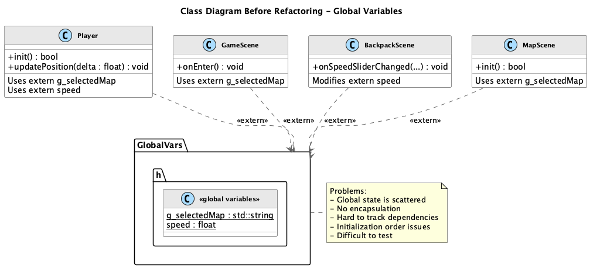

##### 重构后类图

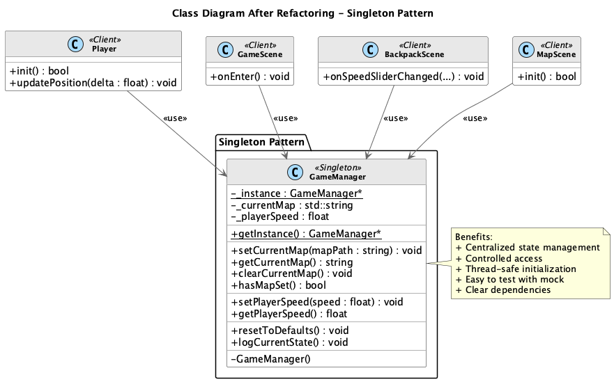

------

#### 4.1.4 重构步骤

针对上述问题，本项目使用单例模式对全局状态管理进行重构，具体步骤如下：

1. **引入单例管理器 `GameManager`**

创建 `GameManager` 类作为全局状态的唯一管理入口，提供 `getInstance()` 获取唯一实例，并以 getter/setter 形式对外暴露状态访问能力。

```cpp
class GameManager {
public:
    static GameManager* getInstance();

    void setCurrentMap(const std::string& mapPath);
    std::string getCurrentMap() const;

    void setPlayerSpeed(float speed);
    float getPlayerSpeed() const;

private:
    GameManager();
    GameManager(const GameManager&) = delete;
    GameManager& operator=(const GameManager&) = delete;

    std::string _currentMap;
    float _playerSpeed;
};
```

2. **将 `extern` 全局变量迁移到 `GameManager` 内部**

把原先分散在 `GlobalVars.h` 中的状态变量改为 `GameManager` 的成员变量，并设置默认值与必要的范围校验。

3. **替换各模块对全局变量的直接访问**

将 `Player`、`GameScene`、`BackpackScene`、`MapScene` 等模块中对 `extern` 的读取/写入改为通过 `GameManager::getInstance()` 访问。

```cpp
// 重构后：使用GameManager替代extern变量
std::string currentMap = GameManager::getInstance()->getCurrentMap();
float playerSpeed = GameManager::getInstance()->getPlayerSpeed();
```

4. **集中处理状态重置与调试输出（可选）**

将“重置默认值”“打印当前状态”等逻辑集中到 `GameManager` 中，便于统一维护与排查问题。

------

#### 4.1.5 实现的改进

通过引入单例模式，全局状态管理在多个方面得到了显著改进：

- **依赖更加显式**：各模块通过统一入口访问状态，依赖关系清晰可追踪。
- **维护成本降低**：新增或调整全局状态只需修改 `GameManager`，避免多处联动修改。
- **访问可控**：可以在 setter 中做范围校验与默认值保护，减少无效状态带来的隐患。
- **职责更清晰**：状态管理职责集中，业务类更专注于自身逻辑。

------

## 五、使用额外模式重构

### 5.1 使用对象池模式（Object Pool Pattern）重构

#### 5.1.1 模式概述

**对象池模式（Object Pool Pattern）** 是一种创建型设计模式，通过预创建并复用对象来减少频繁创建与销毁带来的性能开销。对象池通常维护一组可用对象，客户端从池中“借出”对象使用，用完后再“归还”以备复用。

**模式结构**

| 角色            | 职责                               |
| --------------- | ---------------------------------- |
| **ObjectPool**  | 管理对象的创建、借出、归还与重置   |
| **Client**      | 从对象池获取对象并在使用后归还对象 |
| **PooledObject**| 被池化与复用的对象                 |

**适用场景**

- 对象创建/销毁代价高（如资源对象、渲染对象）
- 对象生命周期短但创建频繁（如子弹、特效、作物精灵）
- 需要降低内存抖动与频繁分配造成的性能波动

#### 5.1.2 问题分析

在重构前的代码中，作物精灵对象在“种植/收获”操作中频繁创建与销毁，存在以下问题：

**问题1：频繁创建对象导致性能开销**

- 每次种植都会调用 `Sprite::create(...)` 创建新的精灵对象。
- 在连续交互（大量种植/收获）场景下，会产生明显的内存分配压力。

```cpp
void Map2Scene::plantCropAt(const Vec2& locationInMap) {
    auto crop = Sprite::create(cropImages[cropIndex]);
    _crops.push_back(crop);
}
```

**问题2：频繁销毁对象造成内存抖动**

- 收获时直接 `removeFromParent()` 并从容器中删除，导致对象生命周期短且频繁释放。
- 容易引发内存碎片化与帧率波动。

```cpp
void Map2Scene::harvestCropAt(const Vec2& locationInMap) {
    crop->removeFromParent();
    _crops.erase(it);
}
```

##### 重构必要性

在“作物种植与收获”这类高频交互模块中，通过对象池复用 Sprite 能够减少重复的创建/销毁，降低内存分配与回收压力，从而提升性能稳定性。因此本项目采用对象池模式对作物精灵管理进行重构。

------

#### 5.1.3 UML类图对比

##### 重构前类图

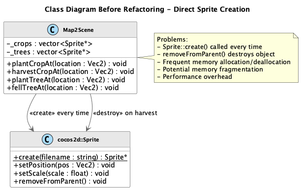

##### 重构后类图

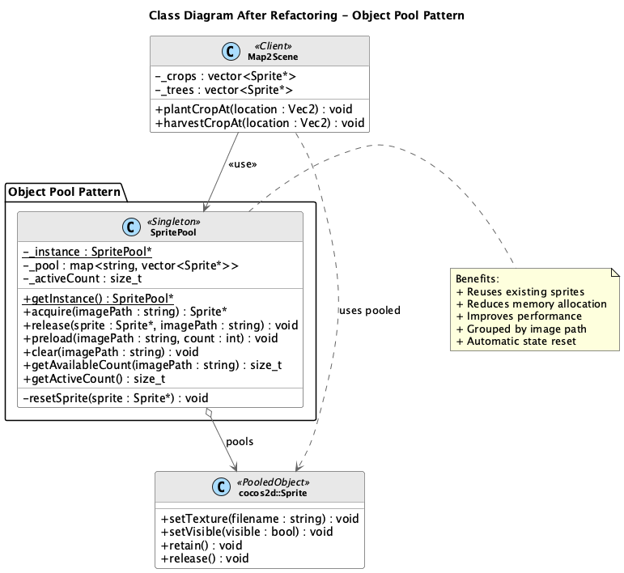

------

#### 5.1.4 重构步骤

针对上述问题，本项目使用对象池模式对作物精灵创建与回收流程进行重构，具体步骤如下：

1. **引入对象池类 `SpritePool`**

创建 `SpritePool` 管理不同图片路径对应的 Sprite 对象集合，提供 `acquire/release` 接口完成借出与归还。

```cpp
class SpritePool {
public:
    static SpritePool* getInstance();

    cocos2d::Sprite* acquire(const std::string& imagePath);
    void release(cocos2d::Sprite* sprite, const std::string& imagePath);

private:
    std::unordered_map<std::string, std::vector<cocos2d::Sprite*>> _pool;
};
```

2. **种植作物时从池中获取对象**

将 `Map2Scene::plantCropAt` 中的 `Sprite::create(...)` 替换为从对象池 `acquire(...)` 获取可复用对象，并初始化必要显示状态。

```cpp
auto crop = SpritePool::getInstance()->acquire(cropImages[cropIndex]);
crop->setVisible(true);
_tiledMap->addChild(crop, 15);
_crops.push_back(crop);
```

3. **收获作物时归还对象到池中**

将原有“移除并销毁”的流程改为“重置并归还”，以便后续复用。

```cpp
SpritePool::getInstance()->release(crop, cropImages[cropIndex]);
_crops.erase(it);
```

4. **统一重置对象状态**

在 `SpritePool` 内部统一重置精灵位置、缩放、可见性、动作等状态，避免复用对象残留旧状态影响下一次使用。

------

#### 5.1.5 实现的改进

通过引入对象池模式，作物精灵管理在多个方面得到了显著改进：

- **减少内存分配与释放**：高频交互场景下对象复用，显著降低内存抖动。
- **提升运行性能稳定性**：降低创建/销毁开销，减少帧率波动风险。
- **职责更清晰**：对象生命周期由 `SpritePool` 统一管理，场景类逻辑更聚焦。
- **更易扩展与监控**：可在对象池中集中统计活跃/空闲对象数量，便于优化与调试。

------

## 六、AI 工具辅助与反思总结

### 6.1 使用的 AI 工具

在本项目的设计模式重构过程中，我们使用了 **Antigravity**（VSCode 集成 Gemini 的 AI 编程助手）作为辅助工具。Antigravity 能够直接在 IDE 中读取项目代码、分析代码结构，并根据我们的需求生成或修改代码。

需要强调的是，我们将 AI 定位为**辅助工具**而非主导者。所有设计决策由团队成员讨论确定，AI 的建议仅作为参考，最终采纳与否由我们判断。

### 6.2 AI 辅助的具体应用

在重构过程中，AI 工具主要在以下环节提供了帮助：

#### 6.2.1 代码问题分析

我们向 AI 提供现有代码片段，请它分析存在的问题。例如，在分析 `Player.cpp` 中的移动状态管理时，我们发现代码使用了多个布尔变量（`_isMovingLeft`、`_isMovingRight` 等），AI 帮助我们识别出这属于"状态管理分散"的代码异味，并建议可以考虑使用状态模式进行重构。

但最终是否采用状态模式、状态类如何划分，这些决策由我们根据项目实际情况确定。

#### 6.2.2 代码框架生成

在确定设计方案后，我们让 AI 根据设计生成代码框架。例如，我们确定要创建 `GameManager` 单例类后，AI 帮助生成了类的头文件和基本实现。但生成的代码需要我们审阅和调整：

- 检查 Cocos2d-x API 是否正确（AI 有时会用错版本）
- 补充项目特定的业务逻辑
- 调整代码风格以符合项目规范

#### 6.2.3 批量代码修改

在将全局变量迁移到 `GameManager` 单例时，需要修改多个文件中的 `extern` 声明和变量引用。AI 帮助我们快速定位需要修改的位置，并生成替换代码。这类重复性工作由 AI 辅助完成，节省了大量时间。

#### 6.2.4 文档和 UML 图生成

AI 辅助生成了项目报告的结构框架和 PlantUML 类图源码。但报告中的技术内容需要我们校验准确性，UML 图也需要检查是否正确反映了代码结构。

### 6.3 我们的核心原则

在整个重构过程中，我们坚持以下原则：

**1. AI 提供选项，我们做决定**

AI 可能会给出多种设计方案，但选择哪种方案需要结合项目实际情况判断。例如，对于事件系统的设计，AI 建议了观察者模式，但具体的事件类型定义、观察者接口设计等细节，都是我们根据游戏功能需求确定的。

**2. 先理解，后使用**

我们没有直接使用 AI 生成的代码，而是先理解其实现逻辑，确认符合设计模式的原理后再采纳。如果对某段代码不理解，我们会查阅资料或讨论清楚，而不是盲目使用。


### 6.4 遇到的问题与解决

在使用 AI 工具时，我们也遇到了一些问题：

| 问题 | 具体表现 | 我们的解决方式 |
|-----|---------|--------------|
| API 版本差异 | AI 生成的代码使用了不存在的 Cocos2d-x 方法 | 查阅官方文档，修正为正确的 API |
| 代码风格不一致 | 生成的命名和注释格式与项目不统一 | 手动调整，保持代码风格一致 |
| 边界条件遗漏 | 部分特殊情况未被考虑 | 代码审阅时发现并补充处理逻辑 |
| 业务理解偏差 | AI 不了解游戏具体玩法，生成的逻辑不完全正确 | 团队成员根据业务需求修改完善 |

这些问题说明，AI 生成的代码不能直接使用，必须经过仔细审阅和测试。

### 6.5 反思与总结

通过本次项目，我们对 AI 辅助开发有了更深入的认识。

在 AI 的价值方面，我们发现它确实能够加速重复性工作，例如批量修改代码、生成框架代码等任务，AI 可以快速完成，节省了大量时间。同时，AI 也能提供设计思路参考，特别是当我们对某些设计模式不太熟悉时，AI 的建议帮助我们理解了模式的适用场景和实现方式。此外，AI 在辅助生成文档和图表方面也发挥了作用，让我们能够更专注于核心的设计和实现工作。

然而，AI 也存在明显的局限性。它不理解项目的整体架构和业务背景，给出的建议有时只是局部最优解。AI 有时会使用错误的 API 或过时的写法，生成的代码不能直接使用。更重要的是，AI 无法替代开发者对代码的理解和判断，最终的设计决策仍需要我们自己做出。

通过这次实践，我们也收获了很多。我们学会了如何合理利用 AI 工具提升开发效率，认识到 AI 只是辅助手段，不能替代学习和思考。同时，我们也培养了对 AI 生成内容的批判性审阅能力，不再盲目信任 AI 的输出。

总的来说，我们认为**合理使用 AI 但不依赖 AI** 是正确的态度。AI 可以帮助我们更高效地完成工作，但设计决策、代码质量、业务逻辑的正确性，最终还是由开发者负责。这也是我们在本次项目中坚持的原则。

------

## 七、其他信息与项目感悟

本项目由三位同学协作完成，每人负责两种设计模式的重构工作。在这个过程中，我们最大的收获是真正理解了设计模式的价值——它们不是为了炫技而存在，而是为了解决实际问题。在重构之前，我们的代码能跑，但改起来很痛苦：改一个地方就要连带改好几处，稍不注意就会引入新的 bug。引入设计模式后，代码结构变得清晰，新增功能也变得简单。我们也认识到，重构不是一蹴而就的事情，需要一步步来，每次只改一个模块，确保改完之后游戏还能正常运行。团队协作方面，我们学会了及时沟通、互相审阅代码，这不仅能发现问题，也能从彼此的代码中学到东西。总的来说，这次项目让我们从"能写代码"向"能写好代码"迈进了一步，也让我们体会到软件工程中设计与重构的重要性。感谢老师的指导和团队成员的相互支持。
