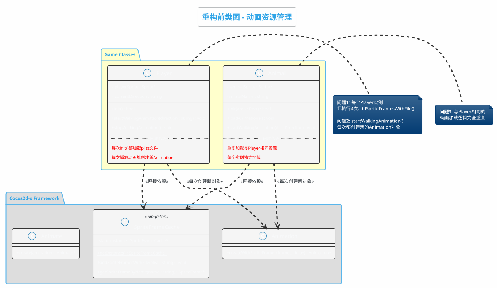
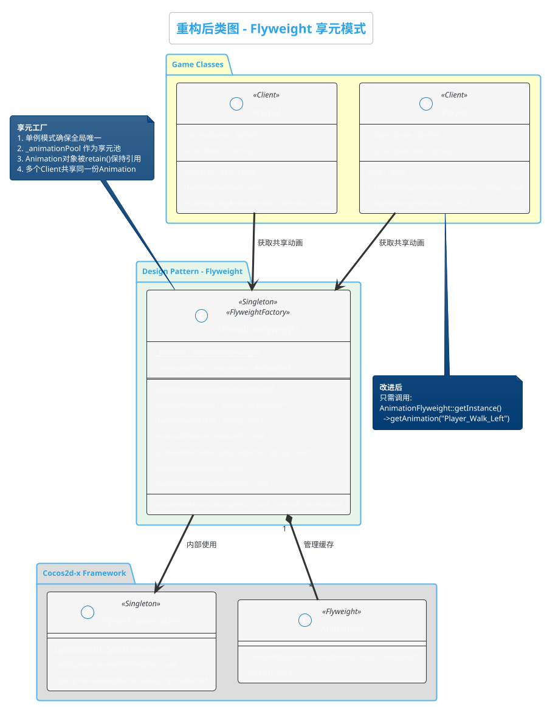
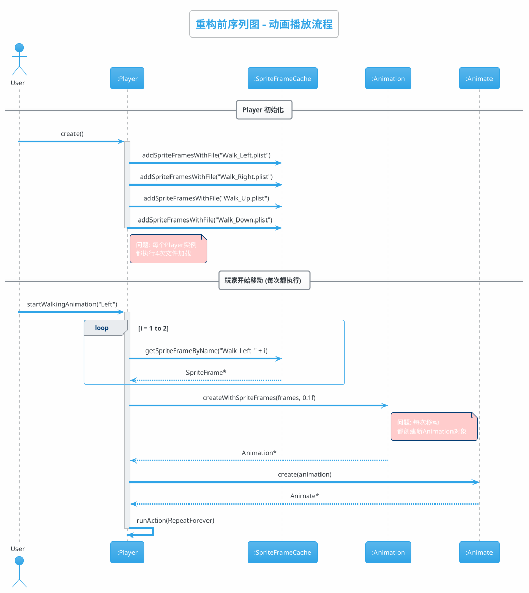
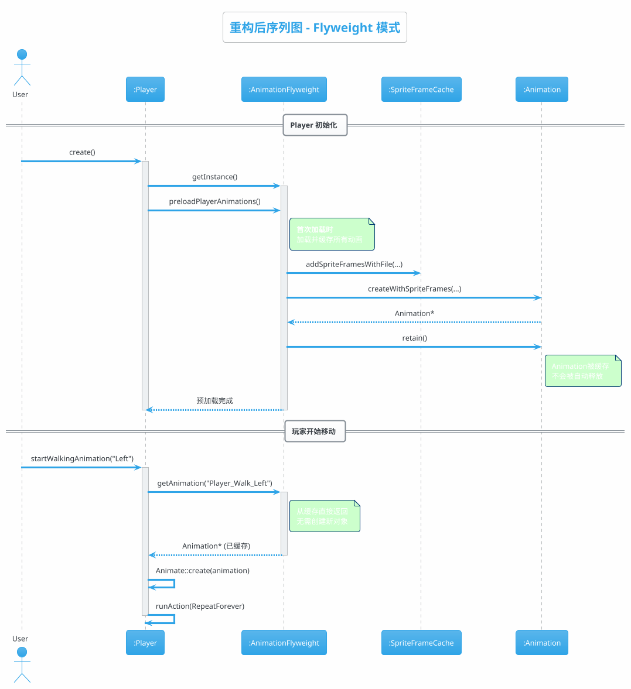
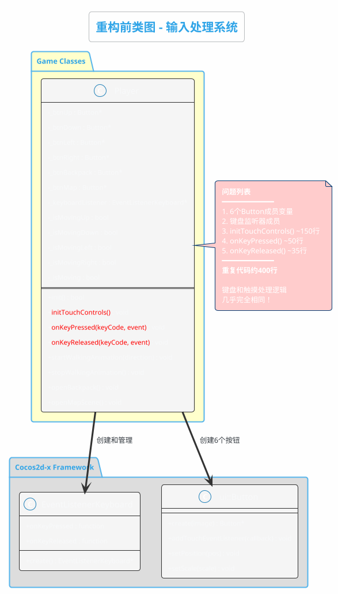
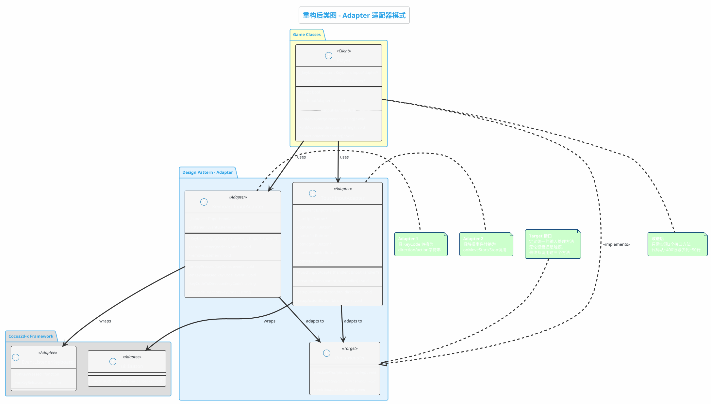
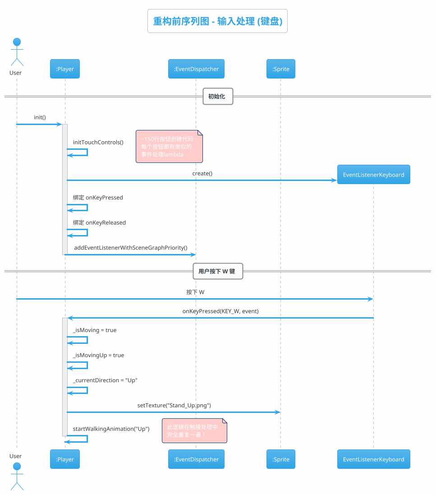
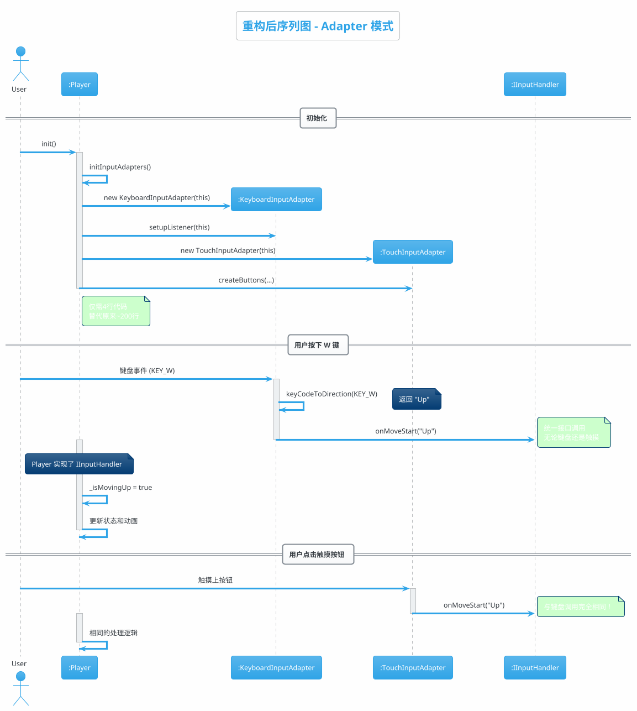
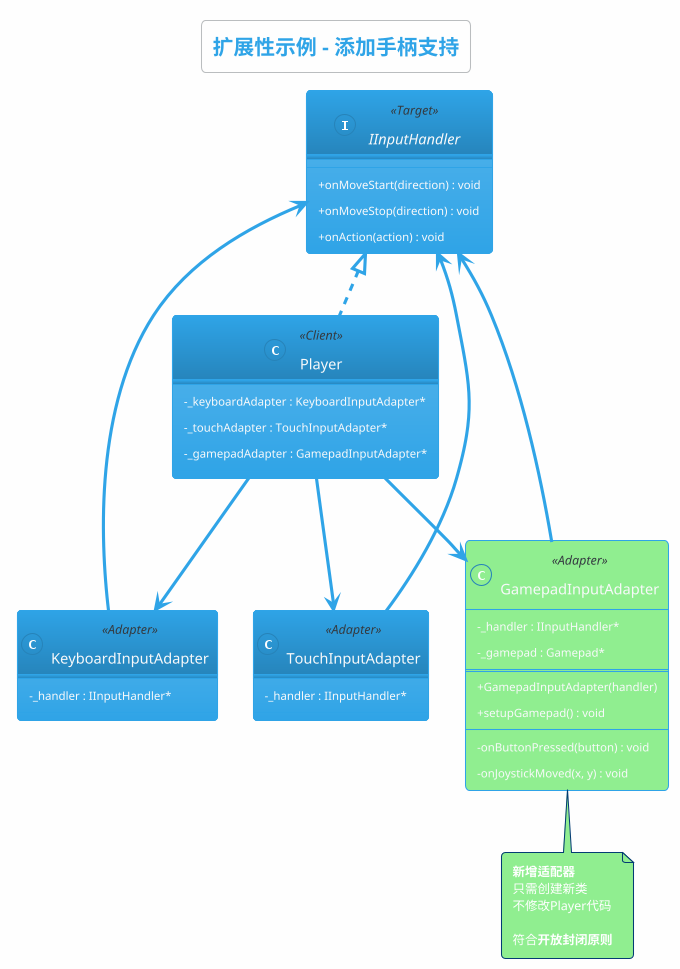
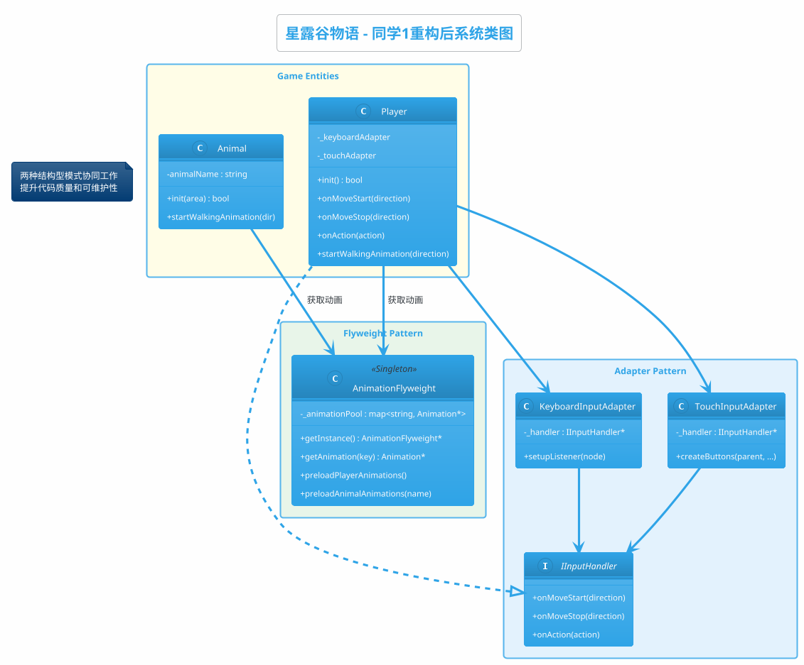

# 同学1 设计模式重构 - PlantUML 类图代码

本文档包含所有 UML 图的 PlantUML 代码，可直接在 PlantUML 工具中渲染。

---

## 一、Flyweight 享元模式

### 1.1 重构前类图



---

### 1.2 重构后类图



---

### 1.3 重构前序列图



---

### 1.4 重构后序列图



---

## 二、Adapter 适配器模式

### 2.1 重构前类图



---

### 2.2 重构后类图



---

### 2.3 重构前序列图



---

### 2.4 重构后序列图



---

### 2.5 扩展性示例 - 添加手柄支持



---

## 三、综合类图

### 3.1 完整重构后系统类图



---

## 四、使用说明

### PlantUML 渲染方式

1. **在线渲染**: 访问 https://www.plantuml.com/plantuml/
2. **VS Code 插件**: 安装 "PlantUML" 插件
3. **本地渲染**: 安装 Java + Graphviz + plantuml.jar

### 导出为图片

```bash
# 命令行导出
java -jar plantuml.jar diagrams.puml -tpng

# 导出为SVG (矢量图,推荐)
java -jar plantuml.jar diagrams.puml -tsvg
```
