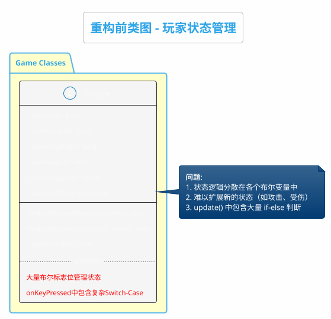
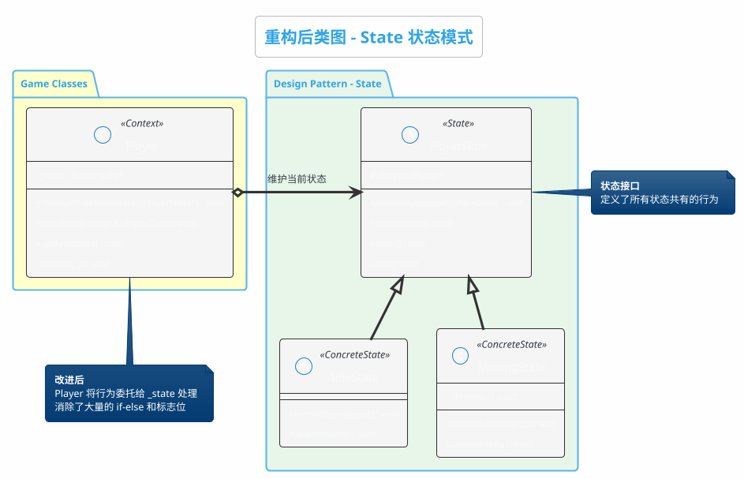
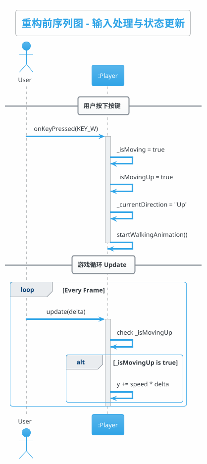
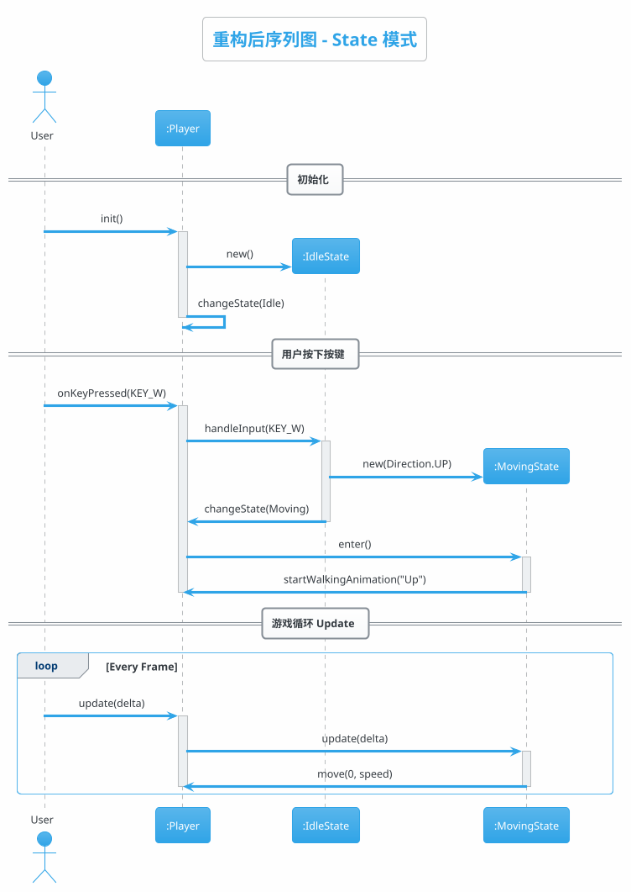
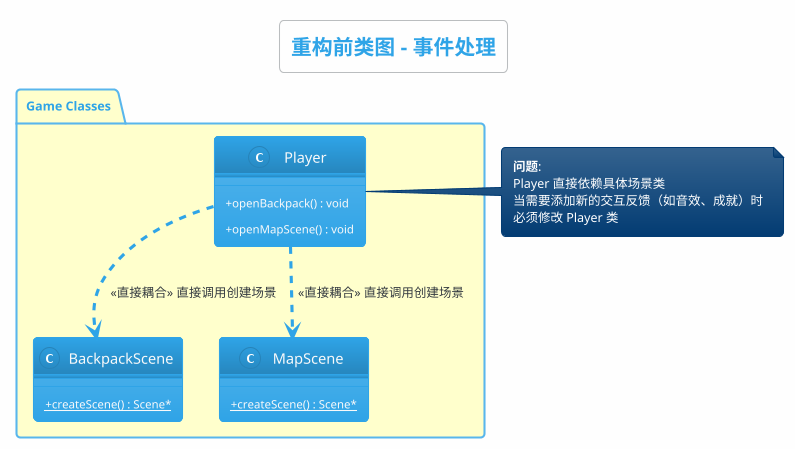
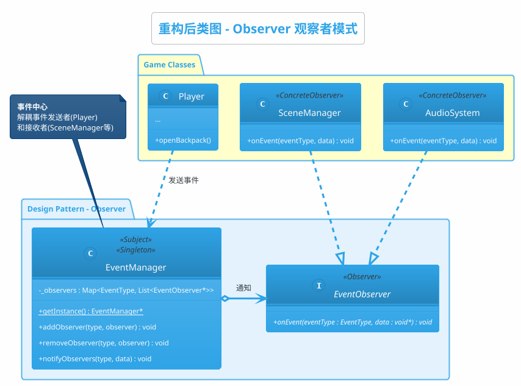
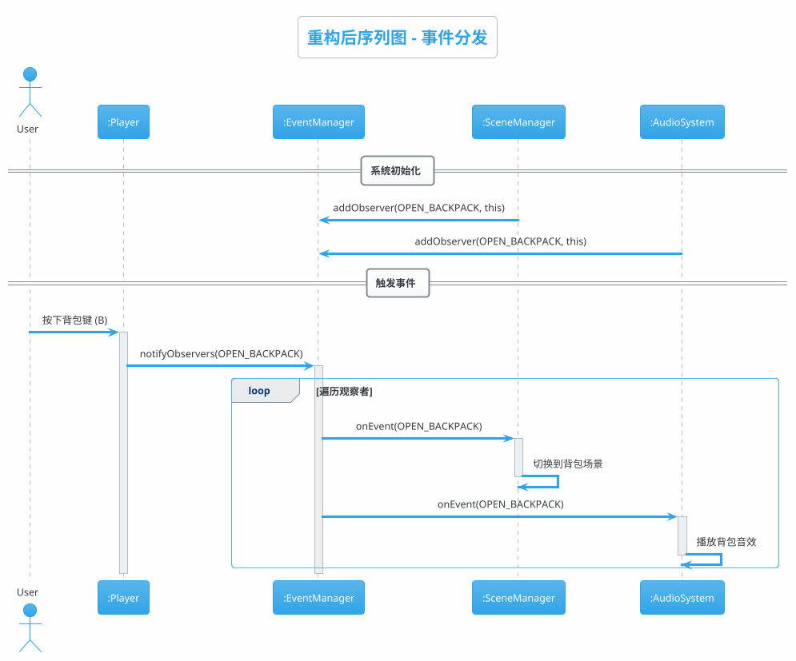
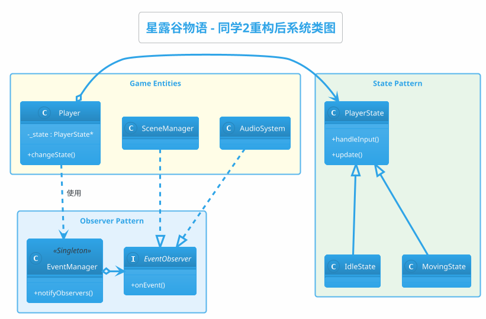

# 同学2 设计模式重构 - PlantUML 类图代码

本文档包含所有 UML 图的 PlantUML 代码，可直接在 PlantUML 工具中渲染。

---

## 一、State 状态模式

### 1.1 重构前类图

---

### 1.2 重构后类图

---

### 1.3 重构前序列图

---

### 1.4 重构后序列图

---

## 二、Observer 观察者模式

### 2.1 重构前类图

---

### 2.2 重构后类图

---

### 2.3 重构后序列图

---

## 三、完整系统类图

